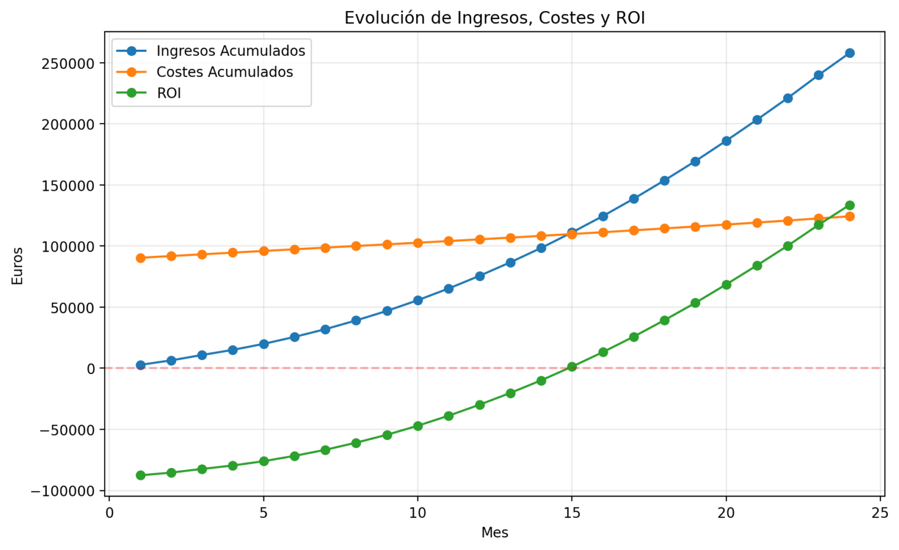
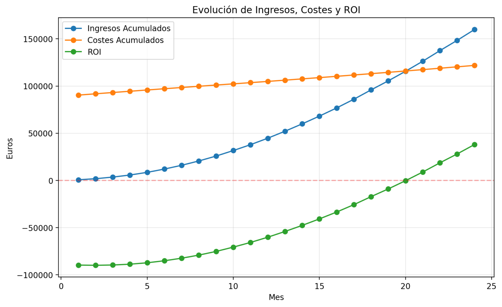
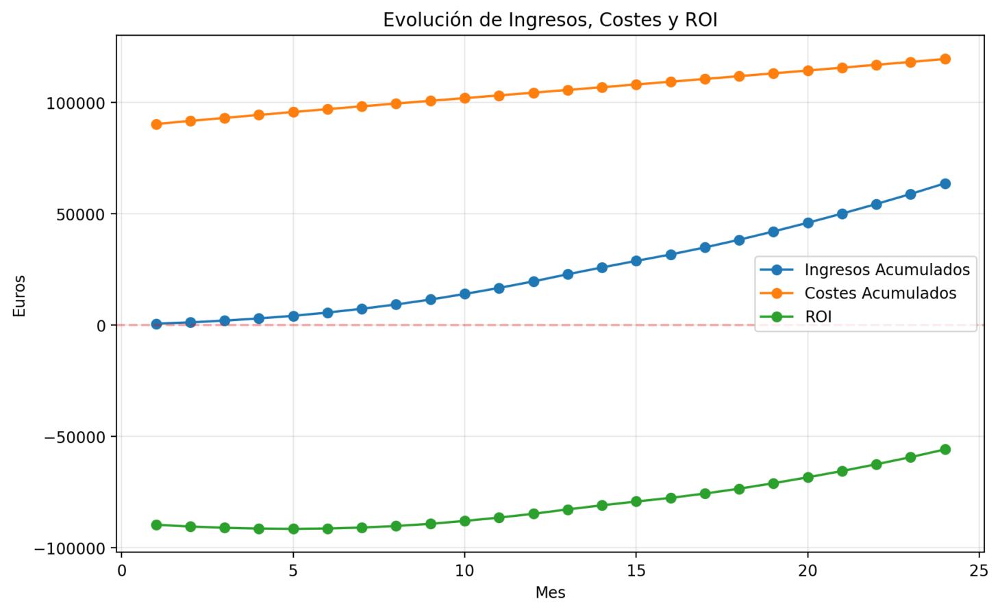

<!-- COMMENT THIS WHEN EXPORTING TO PDF -->

  

<h1 align="center" style="font-size: 30px; font-weight: bold;">
  FISIO FIND  -  DESGLOSE DE LOS COSTES
</h1>

 

**ÍNDICE**
- [**1. INTRODUCCIÓN**](#1-introducción)
- [**2. COSTES DE DESARROLLO (CapEx)**](#2-costes-de-desarrollo-capex)
  - [**2.1. COSTES DE PERSONAL Y HORAS DE TRABAJO**](#21-costes-de-personal-y-horas-de-trabajo)
    - [**Coste por hora según perfil:**](#coste-por-hora-según-perfil)
    - [**Línea base (156 horas)**](#línea-base-156-horas)
    - [**Cálculo del coste mensual con horas variables (X horas)**](#cálculo-del-coste-mensual-con-horas-variables-x-horas)
  - [**2.2. COSTES DE REEMPLAZO DE HARDWARE Y LICENCIAS**](#22-costes-de-reemplazo-de-hardware-y-licencias)
- [**3. COSTES DE PRODUCCIÓN Y DESPLIEGUE (OpEx)**](#3-costes-de-producción-y-despliegue-opex)
- [**4. COSTES DE MANTENIMIENTO Y SOPORTE**](#4-costes-de-mantenimiento-y-soporte)
- [**5. COSTES DE MARKETING**](#5-costes-de-marketing)
- [**6. SITUACIÓN DE COSTES POR SPRINTS**](#6-situación-de-costes-por-sprints)
  - [**6.1. SPRINT 1**](#61-sprint-1)
    - [**Costes estimados**](#costes-estimados)
    - [**Gastos reales**](#gastos-reales)
    - [**Comparativa**](#comparativa)
    - [**Análisis**](#análisis)
  - [**6.2. SPRINT 2**](#62-sprint-2)
    - [**Costes estimados**](#costes-estimados-1)
    - [**Gastos reales**](#gastos-reales-1)
    - [**Comparativa**](#comparativa-1)
    - [**Análisis**](#análisis-1)
  - [**6.3. SPRINT 3**](#63-sprint-3)
    - [**Costes estimados**](#costes-estimados-2)
- [**7. ESTIMACIÓN DE RETORNO DE INVERSIÓN (ROI)**](#7-estimación-de-retorno-de-inversión-roi)
- [**8. ESTIMACIONES Y EJEMPLO DE CÁLCULO**](#8-estimaciones-y-ejemplo-de-cálculo)
  - [**8.1. Escenario Optimista**](#81-escenario-optimista)
  - [**Gráfica de evolución del ROI**](#gráfica-de-evolución-del-roi)
  - [**Factores Clave**](#factores-clave)
  - [**8.2. Escenario Esperado**](#82-escenario-esperado)
  - [**Gráfica de evolución del ROI**](#gráfica-de-evolución-del-roi-1)
  - [**8.3. Escenario Pesimista**](#83-escenario-pesimista)
    - [**Análisis del caso pesimista**](#análisis-del-caso-pesimista)
  - [**Gráfica de evolución del ROI**](#gráfica-de-evolución-del-roi-2)
<!-- COMMENT WHEN EXPORTING TO PDF -->

 

---

**Ficha del documento**

- **Nombre del Proyecto:** FISIO FIND

- **Número de Grupo:** Grupo 6

- **Entregable:** #SPRINT 3

- **Miembros del grupo:** Alberto Carmona Sicre, Antonio Macías Ferrera, Benjamín Ignacio Maureira Flores, Francisco Capote García, Daniel Alors Romero, Daniel Fernández Caballero, Daniel Ruiz López, Daniel Tortorici Bartús, Daniel Vela Camacho, Delfín Santana Rubio, Guadalupe Ridruejo Pineda, Julen Redondo Pacheco, Miguel Encina Martínez, Francisco Mateos Villarejo, Pablo Fernández Pérez, Ramón Gavira Sánchez, Rafael Pulido Cifuentes.

- **Contribuidores:** [Antonio Macías Ferrera](https://github.com/antoniommff) (autor), [Ramón Gavira Sánchez](https://github.com/rgavira123) (autor), [Pablo Fernández Pérez](https://github.com/Letee2) (autor)

- **Fecha de Creación:** 19/02/2025  

- **Versión:** v1.5

 

---

**Historial de modificaciones**

| Fecha         | Versión | Realizada por                               | Descripción de los cambios                       |
| ------------- | ------- | ------------------------------------------- | ------------------------------------------------ |
| 19/02/2025    | v1.0    | Ramón Gavira Sánchez, Pablo Fernández Pérez | Elaboración de la primera versión del documento. |
| 19/02/2025    | v1.1    | Antonio Macías Ferrera                      | Adición del resto de puntos del documento de acuerdo con el *Sprint Planning* general. |
| 24/02/2025    | v1.2    | Antonio Macías Ferrera                      | Modificación del documento para añadir desglose detallado de costes de acuerdo con el *feedback* de la clase del pasado 21/02. |
| 10/03/2025    | v1.3    | Ramón Gavira Sánchez, Pablo Fernández Pérez | Se actualiza el documento de costes de acuerdo a lo solicitado en el #SPRINT 1 y las condiciones de fallo. |
| 11/03/2025    | v1.4    | Antonio Macías Ferrera                      | Correcciones menores de formato. |
| 03/04/2025    | v1.5    | Antonio Macías Ferrera                      | Actualización del documento acorde a los gastos a mitad de Sprint 3. |

 

<!-- \newpage -->

 

# **1. INTRODUCCIÓN**

Este documento detalla el desglose de los costes asociados al desarrollo, producción y despliegue del proyecto **FisioFind**. Se incluyen cálculos basados en horas de trabajo, tarifas por perfil, costes de hardware, licencias, producción, mantenimiento, marketing y soporte. Además, se incorpora una estimación del retorno de inversión (ROI) y se detallan ejemplos de cálculo para ciertos conceptos (por ejemplo, alojamiento de videos).

Trabajaremos con las siguientes variables para el cálculo de costes:

- **Coste de Desarrollo - CapEx** (personal + hardware + licencias + margen 10%)

- **Coste de Producción - OpEx** (soporte + despliegue + transferencia de datos + APIs y otros) 

> [!NOTE] 
> Algunos conceptos (por ejemplo, alojamiento de videos) se analizan de forma separada y pueden no incluirse en el TCO global, pero se consideran en el análisis del ROI.

 

# **2. COSTES DE DESARROLLO (CapEx)**

Esta sección recoge el coste del desarrollo inicial de la aplicación, incluyendo el coste del personal y las inversiones en hardware y licencias necesarias.

## **2.1. COSTES DE PERSONAL Y HORAS DE TRABAJO**

El equipo de desarrollo de Fisio Find está compuesto por **17 personas**, distribuidas en los siguientes perfiles:

- **5 Analistas**
- **1 Project Manager (PM)**
- **11 Desarrolladores Fullstack**

### **Coste por hora según perfil:**

- **Analista:** 30,82 €/hora  
- **Project Manager:** 37,25 €/hora  
- **Desarrollador:** 27 €/hora  

### **Línea base (156 horas)**

Para la planificación económica inicial, se establece una línea base de **156 horas 
por trabajador**, considerando el tiempo establecido por la asignatura más una contigencia por posibles horas extra.

Se dividen en 4 meses de trabajo:

- **Febrero**: 36 horas
- **Marzo**: 48 horas
- **Abril**: 36 horas
- **Mayo**: 36 horas

**Cálculo del coste del personal en el desarrollo  (Línea Base):**

- **Analistas:** 5 × 156 horas × 30,82 €/hora
- **Project Manager:** 1 × 156 horas × 37,25 €/hora
- **Desarrolladores:** 11 × 156 horas × 27 €/hora

El coste total mensual será la suma de estos importes. A este coste base se le añadirá posteriormente un margen de contingencia del **10%**.

### **Cálculo del coste mensual con horas variables (X horas)**

Para meses con distinta carga de trabajo, el coste mensual se ajustará según las horas reales trabajadas (**X horas**), utilizando la siguiente fórmula general:

\[ \text{Coste personal} = X \times [(5 \times 30,82) + (1 \times 37,25) + (11 \times 27)] \]
\[ \text{Coste total (con contigencia)} = Coste personal \times 1.10 \]

## **2.2. COSTES DE REEMPLAZO DE HARDWARE Y LICENCIAS**

**COSTES DE HARDWARE**

Se estima que la **vida útil media de un equipo es de 3 años**, lo que implica que cada año se debe renovar **1/3 de los equipos**. El coste medio de un equipo es **800€**, por lo que:

- Se renuevan aproximadamente 5,5 equipos al año:
  - Renovación anual: 5,5 x 800 € = **4.400 €**

- **Aplicando un margen de contingencia del 20%:**  
  - 4.400 € x 1,20 = **5.280 €/año**  
  - **Coste mensual de hardware:** 5.280 € / 12 ≈ **440 €/mes**

> [!NOTE]
> Este coste se considera únicamente en el primer año (desarrollo inicial). 
> En años posteriores se prevé un coste menor de hardware (por ejemplo, 800 €/año para un grupo reducido de “personas top”).
> Este coste se sumará a los costes de desarrollo y será constante en el tiempo.

 

**COSTES DE LICENCIAS Y HERRAMIENTAS**

1. **GitHub Enterprise:**
   Se utilizará **GitHub Enterprise** para la gestión del código del equipo.
   - Tarifa: 20,04 € por miembro  
   - Total para 17 miembros: 17 x 20,04 € = **340,68 €/mes**

2. **Entorno de Desarrollo/Preproducción:**
   - Coste fijo: **20 €/mes**

- **Total Licencias y Herramientas:** 340,68 + 20 = **360,68 €/mes**  
  - Anual: 360,68 × 12 ≈ **4.328,16 €/año**

> **Resumen CapEx (Primer Año):**  
> - Desarrollo (personal, único): **86.487 €**  
> - Hardware: **5.280 €/año**  
> - Licencias y Herramientas: **4.328 € aprox.**  
> - **Total CapEx Primer Año:** 86.487 + 5.280 + 4.328 ≈ **96.095 €**

 

 

# **3. COSTES DE PRODUCCIÓN Y DESPLIEGUE (OpEx)**

A partir de junio, se activan los costes operativos (OpEx) relacionados con la producción, soporte y despliegue. Estos costes incluirán los siguientes elementos:

1. **Soporte de Chatbot:**

  Para soporte técnico de primer nivel, se estima el plan más caro, con un coste de 425,51 €/mes.

   - Plan premium *Fisio Gold* (para atención de primer nivel): **425,51 €/mes**  

   - Anual: 425,51 × 12 ≈ **5.106 €**

2. **Despliegue, Alojamiento y Transferencia de Datos:**

   - **Despliegue:** 60 €/mes → 60 × 12 = **720 €/año**  

   - **Transferencia de Datos (Google Cloud):** Se estima un coste medio anual de **1.800 €** (valor variable según uso).
     - Dependiente del uso (videos y documentos).  
     - Estimación para APIs (verificación de DNI, mapa, SMS, videollamada): entre **1.000 € y 2.000 € anuales.**
   
   - **Dominio:** 24 €/año  
   
   - **APIs y otros servicios:** 15 €/año  
      
   - Anual: 720 + 24 + 15 + 1.800 = **2.559 €**

> **Resumen OpEx (Primer Año):**  
> - Soporte Chatbot: **5.106 €**  
> - Despliegue: **720 €**  
> - Trasnferencia: **1.800 € aprox.**  
> - Dominio, APIs, otros: **39 €** 
> - **Total OpEx Primer Año:** 2.559 + 5.106 ≈ **7.665 €/año**
> - **Mensual promedio:** 7.665 €/12 ≈ **639 €/mes**

 

 

# **4. COSTES DE MANTENIMIENTO Y SOPORTE**

Tras el lanzamiento, se prevé la necesidad de mantenimiento y soporte, divididos en dos categorías:

1. **Mantenimiento Adaptativo:**  
   - Revisión trimestral asignando a un desarrollador 2 jornadas (≈16 horas/trimestre).  
   - Costo (con tarifa de 27 €/hora): 16/3 ≈ 5,33 horas/mes × 27 ≈ **144 €/mes**  
   
   - Anual: 144 × 12 = **1.728 €/año**

2. **Mantenimiento Correctivo:**  
   - Se estiman 10 incidencias mensuales (1 hora cada una).  
   
   - Costo: 10 × 27 = **270 €/mes**  
   
   - Anual: 270 × 12 = **3.240 €/año**

3. **Soporte Premium (Opcional – Fisio Gold):**  
   - Cobertura en horario laboral con 3 agentes en turnos rotativos: **600 €/mes**  
   
   - Anual: 600 × 12 = **7.200 €/año**

> **Resumen Mantenimiento y Soporte (Primer Año):**  
> - **Total Mantenimiento y Soporte Primer Año:** (144 + 270 + 600) x 12 = **12.168 €/año**
> - **Mensual promedio:** 12.168 €/12 ≈ **1.014 €/mes**

 

 

# **5. COSTES DE MARKETING**

Los costes de marketing se calculan en función de las campañas publicitarias, promociones y otros esfuerzos de marketing necesarios para atraer usuarios a la plataforma. Se estima un presupuesto mensual de **500€** para marketing digital, incluyendo anuncios en redes sociales, **Google Ads** y otros canales relevantes.

- **Marketing Digital:**  
  - Presupuesto mensual: **500 €/mes**  
  - Anual: 500 x 12 = **6.000 €/año**

 

 

# **6. SITUACIÓN DE COSTES POR SPRINTS**

Para llevar a cabo un análisis de la situacion economica del equipo en cada Sprint consideraremos que las únicas desviaciones posibles son sobre la línea base de horas de trabajo, el resto de los costes se mantendrán constantes, principalmente porque hasta que no se acabe el desarrollo no incurrimos en gastos de mantenimiento, y el resto de gastos (licencias, hardware, etc.) son fijos. Por otro lado el gasto por las APIs y otros servicios se considera constante, ya que no se espera que varíe en función de la carga de trabajo, es más bien un margen que se ha añadido para cubrir posibles gastos no previstos.

## **6.1. SPRINT 1**

Nos encontramos en la primera fase de desarrollo, por tanto los gastos que incurrimos en este momento son los de personal y gastos fijos de licencias, hardware y marketing. A continuación se detalla el cálculo de los costes estimados y reales del Sprint 1.

### **Costes estimados**

**Horas estimadas:**

A fecha de 11/03/2025 las horas estimadas son **56 horas**, tomando el 100% del mes de Febrero y un 30% de Marzo. Por lo que el coste total del equipo sería:

**Coste personal** = 56 × [(5 × 30,82) + (1 × 37,25) + (11 × 27)]

**Coste total (con contingencia)** = Coste personal × 1.10

**Cálculo detallado:**

| Concepto                | Cantidad | Tarifa €/hora | Total €/hora |
|-------------------------|----------|---------------|--------------|
| Analistas               | 5        | 30,82         | 154,10       |
| Project Manager         | 1        | 37,25         | 37,25        |
| Desarrolladores         | 11       | 27,00         | 297,00       |

- **Total por hora:** 488,35 €/hora       
- **Horas estimadas:**  56 horas
- **Coste personal:**  27.347,60 € 
- **Coste con contingencia (10%):**  30.082,36 €    

**Costes adicionales:**

En este momento los costes adicionales son únicamente:

- Reserva de Hardware (440 €/mes)
- Licencias y Herramientas (360,68 €/mes) #Github y entorno de desarrollo
- Marketing (500 €/mes)

**Resumen del Sprint 1:**
| Concepto                | Total (€) |
|-------------------------|-----------|
| Coste personal  | 30.082,36 |
| Coste de Hardware | 440 |
| Licencias y Herramientas | 360,68 |
| Marketing | 500 |
| **Total** | 31.383,04 |

### **Gastos reales**

**Horas trabajadas:**

A fecha de 11/03/2025 las horas trabajadas por todo el equipo según el seguimiento en **Clockify** son aproximadamente 1.127 horas, siendo las horas por persona *(1.127/17)* aproximadamente 66 horas.

**Coste personal** = 66 × [(5 × 30,82) + (1 × 37,25) + (11 × 27)]

**Coste total (con contingencia)** = Coste personal × 1.10

**Cálculo detallado:**
| Concepto                | Cantidad | Tarifa €/hora | Total €/hora |
|-------------------------|----------|---------------|--------------|
| Analistas               | 5        | 30,82         | 154,10       |
| Project Manager         | 1        | 37,25         | 37,25        |
| Desarrolladores         | 11       | 27,00         | 297,00       |

- **Total por hora:** 488,35 €/hora       
- **Horas trabajadas:**  66 horas
- **Coste personal:**  32.221,10 € 
- **Coste con contingencia (10%):**  35.443,21 € 

**Costes adicionales:**
- Reserva de Hardware (440 €/mes)
- Licencias y Herramientas (360,68 €/mes) #Github y entorno de desarrollo
- Marketing (500 €/mes)

**Resumen del Sprint 1:**
| Concepto                | Total (€) |
|-------------------------|-----------|
| Coste personal  | 35.443,21 |
| Coste de Hardware | 440 |
| Licencias y Herramientas | 360,68 |
| Marketing | 500 |
| **Total** | 36.743,89 |
 

### **Comparativa**
| Concepto                | Estimado (€) | Real (€) | Diferencia (€) |
|-------------------------|--------------|----------|----------------|
| Coste personal         | 30.082,36    | 32.221,10| 2.138,74       |
| Coste de Hardware      | 440          | 440      | 0              |
| Licencias y Herramientas | 360,68     | 360,68   | 0              |
| Marketing              | 500          | 500      | 0              |
| **Total**              | 31.383,04    | 36.743,89| 5.360,85       |
 

### **Análisis**
El coste real del Sprint 1 ha sido superior al estimado, principalmente por un mayor número de horas trabajadas por el equipo. La diferencia total es de 5.360,85 €, lo que supone un incremento del 17,1% respecto al coste estimado. La razón principal de esta desviación fue el cambio de idea al inicio del proyecto, lo que conllevó una deuda técnica en las tareas iniciales, que tuvieron que volver a realizarse después del esfuerzo inicial.

## **6.2. SPRINT 2**

Procedemos a desglosar el estado económico del proyecto para este segundo Sprint. Haremos un análisis y comparativa entre las estimaciones que planificamos y el resultado real, fruto de las horas trabajadas y los recursos asignados.

### **Costes estimados**

A fecha de 27/03/2025 las horas estimadas son **34 horas**, tomando el 70% restante del mes de Marzo. Por lo que el coste total del equipo sería: 

**Coste personal** = 34 × [(5 × 30,82) + (1 × 37,25) + (11 × 27)]

**Coste total (con contingencia)** = Coste personal × 1.10

**Cálculo detallado:**

| Concepto                | Cantidad | Tarifa €/hora | Total €/hora |
|-------------------------|----------|---------------|--------------|
| Analistas               | 5        | 30,82         | 154,10       |
| Project Manager         | 1        | 37,25         | 37,25        |
| Desarrolladores         | 11       | 27,00         | 297,00       |

- **Total por hora:** 488,35 €/hora       
- **Horas estimadas:**  34 horas
- **Coste personal:**  16.604 € 
- **Coste con contingencia (10%):**  18.264,29 €    

**Costes adicionales:**

Para este Sprint, añadiremos los costes de las licencias de **ChatGPT Pro** y **Canva Pro**, añadiendo un total de **32€/mes** a los costes de Licencias y Herramientas.

- Reserva de Hardware (440 €/mes)
- Licencias y Herramientas (392,68 €/mes) 
- Marketing (500 €/mes)

**Resumen del Sprint 1:**
| Concepto                | Total (€) |
|-------------------------|-----------|
| Coste personal  | 18.264,29 |
| Coste de Hardware | 440 |
| Licencias y Herramientas | 392,68 |
| Marketing | 500 |
| **Total** | 19.596,97 |

### **Gastos reales**

**Horas trabajadas:**

Según el seguimiento en **Clockify**, el equipo ha trabajado **29 horas** en promedio por persona.

**Coste personal** = 29 × [(5 × 30,82) + (1 × 37,25) + (11 × 27)]

**Coste total (con contingencia)** = Coste personal × 1.10

**Cálculo detallado:**
| Concepto                | Cantidad | Tarifa €/hora | Total €/hora |
|-------------------------|----------|---------------|--------------|
| Analistas               | 5        | 30,82         | 154,10       |
| Project Manager         | 1        | 37,25         | 37,25        |
| Desarrolladores         | 11       | 27,00         | 297,00       |

- **Total por hora:** 488,35 €/hora       
- **Horas trabajadas:**  29 horas  
- **Coste personal:**  14.172,15 €  
- **Coste con contingencia (10%):**  15.589,37 €  

Para este Sprint, añadiremos los costes de las licencias de **ChatGPT Pro** y **Canva Pro**, añadiendo un total de **32€/mes** a los costes de Licencias y Herramientas.

**Costes adicionales:**
- Reserva de Hardware (440 €/mes)
- Licencias y Herramientas (392,68 €/mes)
- Marketing (500 €/mes)

**Resumen del Sprint 2:**
| Concepto                | Total (€) |
|-------------------------|-----------|
| Coste personal  | 15.589,37 |
| Coste de Hardware | 440 |
| Licencias y Herramientas | 392,68 |
| Marketing | 500 |
| **Total** | 16.922,05 € |

A este total, le sumaremos el exceso de -5.360.85 € que arrastramos del Sprint 1, dándonos un coste de:

### **Comparativa**
| Concepto                | Estimado (€) | Real (€) | Diferencia (€) |
|-------------------------|--------------|----------|----------------|
| Coste personal         | 18.264,29    | 15.589,37| + 2.674,92       |
| Coste de Hardware      | 440          | 440      | 0              |
| Licencias y Herramientas | 392,68     | 392,68   | 0              |
| Marketing              | 500          | 500      | 0              |
| Exceso S1               |   X          | X        | - 5.360,85
| **Total**              | 19.596,97    | 16.922,05   | - 2.685,93€       |

### **Análisis**

El coste real del Sprint 2 ha sido inferior al planificado, sin embargo al arrastrar una deuda de más de 5.000€ seguimos estándo por detrás en cuanto a costes, sin embargo nos hemos recuperado en prácticamente un 50%. El haber contemplado horas extra ha hecho que la carga de trabajo si se reduce esto se traduzca en ahorro para el equipo. Además no olvidemos que aún asi estamos considerando una contingencia del 10% por tanto siempre que estemos por debajo del aumento de 10% en cuanto a costes, seguimos en el buen camino.

Para ser exactos, a finalizar el Sprint 2 seguimos un 13,7% por encima de lo planificado, una reducción de casi 4 puntos respecto al Sprint 1.

---

## **6.3. SPRINT 3**

Nos encontramos en la tercera fase de desarrollo. De forma similar a los anteriores sprint, haremos una comparativa entre el coste real y el que estimamos en nuestra fase de planificación. 
### **Costes estimados**

**Horas estimadas:**

A fecha de 8/04/2025, las horas estimadas por persona para el Sprint 3 son **22 horas**, contando con un 60% del mes de abril.

**Coste personal** = 22 × [(5 × 30,82) + (1 × 37,25) + (11 × 27)]

**Coste total (con contingencia)** = Coste personal × 1.10

**Cálculo detallado:**

| Concepto                | Cantidad | Tarifa €/hora | Total €/hora |
|-------------------------|----------|---------------|--------------|
| Analistas               | 5        | 30,82         | 154,10       |
| Project Manager         | 1        | 37,25         | 37,25        |
| Desarrolladores         | 11       | 27,00         | 297,00       |

- **Total por hora:** 488,35 €/hora       
- **Horas estimadas:**  60 horas  
- **Coste personal:**  10.743,7 €  
- **Coste con contingencia (10%):**  11.818,07 €    

**Costes adicionales:**

Para este Sprint, añadiremos los costes de las licencias de **ChatGPT Pro** y **Canva Pro**, añadiendo un total de **32€/mes** a los costes de Licencias y Herramientas.

- Reserva de Hardware (440 €/mes)
- Licencias y Herramientas (392,68 €/mes)
- Marketing (500 €/mes)

**Resumen del Sprint 3:**
| Concepto                | Total (€) |
|-------------------------|-----------|
| Coste personal  | 11.818,07 |
| Coste de Hardware | 440 |
| Licencias y Herramientas | 392,68 |
| Marketing | 500 |
| **Total** | 13.150,75 |

### **Gastos reales**

**Horas trabajadas:**

Según el seguimiento en **Clockify**, el equipo ha trabajado **23 horas** en promedio por persona.

**Coste personal** = 23 × [(5 × 30,82) + (1 × 37,25) + (11 × 27)]

**Coste total (con contingencia)** = Coste personal × 1.10

**Cálculo detallado:**
| Concepto                | Cantidad | Tarifa €/hora | Total €/hora |
|-------------------------|----------|---------------|--------------|
| Analistas               | 5        | 30,82         | 154,10       |
| Project Manager         | 1        | 37,25         | 37,25        |
| Desarrolladores         | 11       | 27,00         | 297,00       |

- **Total por hora:** 488,35 €/hora       
- **Horas trabajadas:**  23 horas  
- **Coste personal:**  11.232,15 €  
- **Coste con contingencia (10%):**  12.355,35 €  

Para este Sprint, añadiremos los costes de las licencias de **ChatGPT Pro** y **Canva Pro**, añadiendo un total de **32€/mes** a los costes de Licencias y Herramientas.

### **Comparativa**
| Concepto                | Estimado (€) | Real (€) | Diferencia (€) |
|-------------------------|--------------|----------|----------------|
| Coste personal         | 11.818,07    | 12.355,35 |-537,28       |
| Coste de Hardware      | 440          | 440      | 0              |
| Licencias y Herramientas | 392,68     | 392,68   | 0              |
| Marketing              | 500          | 500      | 0              |
| Exceso S2               |   X          | X        | - 2.685,93€  
| **Total**              | 13.150,75    | 13.688,23  | - 3.233,21       |

 

El coste estimado para los 3 Sprints fue de **64.130,76€** y el gasto real fue de **67.363,97€**, en porcentaje esto se traduce en un 5% más de coste de lo previsto, dentro de la contingencia establecida de un 10% de los costes.

En cuanto al gasto de Marketing, en todos los sprints siempre incurrimos en un gasto de 500€/mes, el sueldo base de un community manager.

# **7. ESTIMACIÓN DE RETORNO DE INVERSIÓN (ROI)**

La estimación del ROI se basa en:

- **Registro Inicial:** X fisioterapeutas el primer mes.
- **Registros finales de la estimación:** Y fisioterapeutas el último mes.
- **Factor de fluctuación:** 30% (representa posibles altas y bajas de fisioterapeutas en la plataforma).

- **Planes de Suscripción:**

  - **Plan Estándar:** 17,99 €/mes  

  - **Plan PRO:** 24,99 €/mes (estimando que no superará el 20% de los registros)

- **Parámetros de vídeos subidos:** Para el cálculo del ROI también se tienen en cuenta los vídeos subidos por los fisioterapeutas y el streaming de los mismos. Estos parámetros serán modificables, pero partimos de:
  - **Vídeos por Fisio (Básico): 10 vídeos subidos**
  - **Vídeos por Fisio (Gold): 15 vídeos subidos**
  - **(%) de consumo de vídeos: 70%**

- El resto de los costes son los indicados en los apartados anteriores, en concreto otro parámetro modificable es el **número de incidencias mensuales**, que actualmente se ha fijado en 10, decreciendo 1 cada mes con un mínimo de 1.

El análisis del ROI es **dinámico** y, con está web de cálculo de viabilidad que hemos elaborado, podremos modificar los parámetros de análisis de costes y ROI.
Esta herramienta nos permitirá observar de manera dinámica el valor de retorno de la inversión, y el valance de ganancias y pérdidas por meses tomando en cuenta valores como el soporte técnico, el número de usuarios activos en la plataforma cada mes, la subida de vídeos o el tipo de suscripición de los fisioterapeutas inscritos en la plataforma.

[Análisis de Costes y ROI - FisioFind](https://viabilitycalculator-ea5fgpjtyn5jkuq492xz2t.streamlit.app)

Este tipo de análisis dinámico servirá como base para que el equipo pueda modificar los parámetros y actualizar los costes de manera flexible si el proyecto, por su escalabilidad, plazos o tecnologías empleadas se vea obligado a recalcular los costes.

# **8. ESTIMACIONES Y EJEMPLO DE CÁLCULO**

A continuación mostraremos tres (3) escenarios diferentes para el retorno de la inversión (ROI) en el proyecto Fisio Find. Esta estimación se hará con una duración de 24 meses, teniendo un escenario **optimista**, **esperada** y **pesimista**.

## **8.1. Escenario Optimista**

Estos valores son los más optimistas, ya que partiríamos con un lanzamiento muy exitoso, partiendo de los 17 fisioterapeutas piloto que se han registrado en nuestro formulario y que cada uno de ellos ha invitado a 5 colegas a unirse a la plataforma.

En cuanto a la estimación final, comparándonos con nuestro mayor competido [TuFisio](https://tufisio.com), que actualmente cuenta con más de 1.389 fisioterapeutas registrados en su plataforma, nuestra aspiración más optimista sería alcanzar el 72% de su base de usuarios.

- **Registro Inicial:** 100 fisioterapeutas el primer mes.
- **Registros finales de la estimación:** 1000 fisioterapeutas el último mes.
- **Coste de Desarrollo (inversión inicial):** 88,973.85 €
- **Coste de Operación total (período analizado):** 35,302.31 €
- **Ingresos Acumulados en el último mes:** 16,232.72 €
- **Margen del Último Mes:** 14,541.16 €
- **ROI Final:** 124,578.67 € (+140.0%)
- **Punto de equilibrio:** Mes 15

## **Gráfica de evolución del ROI**
La siguiente gráfica muestra la evolución de los ingresos acumulados, costes acumulados y el ROI a lo largo de los 24 meses del análisis:

---

Para ver todos los detalles de los ingresos y costes mes a mes, consulta el siguiente enlace:

🔗 [Desglose Completo de Costes - GitHub Gist](https://gist.github.com/rgavira123/686b4021d3083f40341da5cfc1384f2d)

## **Factores Clave**
1. **Punto de Equilibrio en el mes 15:** A partir de este mes, los ingresos acumulados superan los costes acumulados, lo que indica el inicio de la rentabilidad del proyecto.
2. **Ingresos crecientes:** La tendencia de ingresos es ascendente, lo que sugiere que la estrategia de captación de fisioterapeutas y monetización está funcionando de acuerdo con las expectativas.
3. **Costes operativos controlados:** A pesar de una inversión inicial alta, los costes de operación mensuales no crecen de manera desproporcionada, permitiendo una buena rentabilidad en el largo plazo.
4. **Margen del último mes alto:** Con 14,541.16 € de margen en el último mes analizado, el proyecto muestra un rendimiento financiero positivo.

## **8.2. Escenario Esperado**

Este escenario representa un crecimiento más realista, basado en el comportamiento observado en otros proyectos similares. Partimos de que cada fisioterapeuta piloto ha invitado a un colega a unirse, y el crecimiento se mantiene constante durante 24 meses, sumando entre 20 y 30 fisioterapeutas nuevos cada mes.

- **Registro Inicial:** 34 fisioterapeutas el primer mes.
- **Registros finales de la estimación:** 650 fisioterapeutas el último mes.
- **Coste de Desarrollo (inversión inicial):** 88,973.85 €
- **Coste de Operación total (período analizado):** 32,894.68 €
- **Ingresos Acumulados en el último mes:** 11,411.12 €
- **Margen del Último Mes:** 9,901.53 €
- **ROI Final:** 37,947.42 € (+42.7%)
- **Punto de equilibrio:** Mes 21

## **Gráfica de evolución del ROI**
La siguiente gráfica muestra la evolución de los ingresos acumulados, costes acumulados y el ROI a lo largo de los 24 meses del análisis:

---

Para ver todos los detalles de los ingresos y costes mes a mes, consulta el siguiente enlace:

🔗 [Desglose Completo de Costes - GitHub Gist](https://gist.github.com/rgavira123/53d8d5a1038fe710fbc8a27f6922e89f)

## **8.3. Escenario Pesimista**

Este escenario refleja el peor de los casos, en el que el crecimiento es más lento y no se alcanza el punto de equilibrio dentro del período analizado. En esta situación, partimos con los **17 fisioterapeutas piloto**, sin que estos hayan conseguido invitar a nuevos colegas. El crecimiento mensual es limitado, sumando entre 10 y 15 fisioterapeutas nuevos cada mes.

- **Registro Inicial:** 17 fisioterapeutas el primer mes.
- **Registros finales de la estimación:** 300 fisioterapeutas el último mes.
- **Coste de Desarrollo (inversión inicial):** 88,973.85 €
- **Coste de Operación total (período analizado):** 30,621.68 €
- **Ingresos Acumulados en el último mes:** 4,781.42 €
- **Margen del Último Mes:** 3,467.31 €
- **ROI Final:** -55,890.14 € (-62.8%)
- **Punto de equilibrio:** No alcanzado en los 24 meses

### **Análisis del caso pesimista**
Este escenario muestra que, con el ritmo actual de crecimiento, **no se alcanza la rentabilidad** dentro del período analizado. Para lograrlo, se necesitaría:
1. **Aumentar el número de fisioterapeutas activos a 250 (actualmente 238)**.
2. **Incrementar el precio promedio de suscripción en 1.01 € (actualmente 20.09 €)**.

## **Gráfica de evolución del ROI**
La siguiente gráfica muestra la evolución de los ingresos acumulados, costes acumulados y el ROI a lo largo de los 24 meses del análisis:

---

Para ver todos los detalles de los ingresos y costes mes a mes, consulta el siguiente enlace:

🔗 [Desglose Completo de Costes - GitHub Gist](https://gist.github.com/rgavira123/f3b55ff9f66e89878e05d7646b7ec80f)

 

 

*Este documento es un análisis inicial y podrá ser actualizado a medida que se disponga de datos reales y se ajusten los parámetros operativos y de mercado.*
