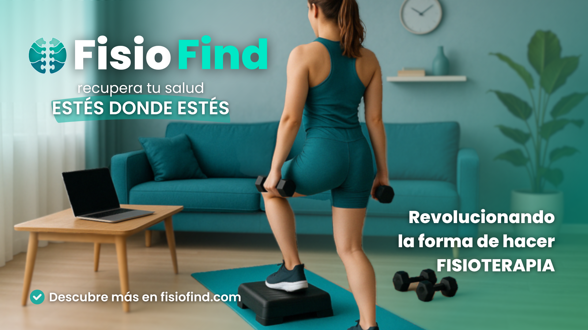

<!-- ---
title: "MARKETING PLANNING"                          # CHANGE IF NEEDED
subtitle: "FISIO FIND - Grupo 6 - #PPL"
author: [Alberto Carmona Sicre, Antonio Macías Ferrera, Benjamín Ignacio Maureira Flores, Francisco Capote García, Daniel Alors Romero, Daniel Fernández Caballero, Daniel Ruiz López, Daniel Tortorici Bartús, Daniel Vela Camacho, Delfín Santana Rubio, Guadalupe Ridruejo Pineda, Julen Redondo Pacheco, Miguel Encina Martínez, Francisco Mateos Villarejo, Pablo Fernández Pérez, Ramón Gavira Sánchez, Rafael Pulido Cifuentes]
date: "20/04/2025"                                        # CHANGE IF NEEDED
subject: "ISPP"
lang: "es"
toc: true
titlepage: true
titlepage-text-color: "1C1C1C"
titlepage-rule-color: "1C1C1C"
titlepage-rule-height: 0
colorlinks: true
linkcolor: blue
titlepage-background: "../.backgrounds/background1V.pdf"  # CHANGE IF NEEDED
header-left: "MARKETING SPRINT"                    # CHANGE IF NEEDED
header-right: "20/04/2025"                                # CHANGE IF NEEDED
footer-left: "FISIO FIND"
documentclass: scrartcl
classoption: "table"
--- -->

<!-- COMMENT THIS WHEN *EXPORTING* TO PDF -->

  

<h1 align="center" style="font-size: 30px; font-weight: bold;">
  FISIO FIND  -  MARKETING PLANNING
</h1>

 

**ÍNDICE**

- [**1. INTRODUCCIÓN**](#1-introducción)
- [2. ESTRATEGIA DE IMPACTO MEDIÁTICO Y MARKETING DIGITAL](#2-estrategia-de-impacto-mediático-y-marketing-digital)
  - [2.1. Posicionamiento SEO](#21-posicionamiento-seo)
    - [Objetivo:](#objetivo)
    - [Acciones:](#acciones)
      - [1. Investigación y Selección de Palabras Clave](#1-investigación-y-selección-de-palabras-clave)
      - [2. Optimización On-Page](#2-optimización-on-page)
      - [3. Creación de Contenido de Valor](#3-creación-de-contenido-de-valor)
      - [4. SEO Técnico](#4-seo-técnico)
      - [5. Monitoreo y Ajustes](#5-monitoreo-y-ajustes)
    - [Indicadores Clave de Rendimiento (KPIs)](#indicadores-clave-de-rendimiento-kpis)
  - [2.2. Campañas de Anuncios Segmentadas](#22-campañas-de-anuncios-segmentadas)
    - [Objetivo:](#objetivo-1)
    - [Acciones:](#acciones-1)
  - [2.3. Gestión de Redes Sociales](#23-gestión-de-redes-sociales)
    - [Objetivo:](#objetivo-2)
    - [Acciones:](#acciones-2)
  - [2.4. Análisis de Costes de Marketing](#24-análisis-de-costes-de-marketing)
    - [Objetivo:](#objetivo-3)
    - [Acciones:](#acciones-3)
      - [1. Anuncios Pagados (SEM y Social Ads)](#1-anuncios-pagados-sem-y-social-ads)
      - [2. Herramientas SEO](#2-herramientas-seo)
      - [3. Software de Gestión de Redes Sociales](#3-software-de-gestión-de-redes-sociales)
      - [4. Herramientas de Diseño y Edición de Video](#4-herramientas-de-diseño-y-edición-de-video)
      - [5. Otras Inversiones](#5-otras-inversiones)
    - [Resumen de Inversión Mensual](#resumen-de-inversión-mensual)
    - [Medición del Impacto](#medición-del-impacto)
- [**3. PRESENTACIÓN DEL PROYECTO**](#3-presentación-del-proyecto)
  - [3.1. Presentación Ensayo World Project Launch (10 min)](#31-presentación-ensayo-world-project-launch-10-min)
  - [3.2. Presentación Técnica (5 min)](#32-presentación-técnica-5-min)
- [**4. ASIGNACIÓN DE ROLES**](#4-asignación-de-roles)
- [**5. CALENDARIO GENERAL DE EJECUCIÓN**](#5-calendario-general-de-ejecución)
- [6. ANEXOS](#6-anexos)
  - [6.1. Palabras Clave](#61-palabras-clave)
  - [6.2. Calendario de Publicaciones - MAYO 2025](#62-calendario-de-publicaciones---mayo-2025)
    - [Semana 1 (5 - 11 mayo)](#semana-1-5---11-mayo)
    - [Semana 2 (12 - 18 mayo)](#semana-2-12---18-mayo)
    - [Semana 3 (19 - 23 mayo)](#semana-3-19---23-mayo)
  - [6.3. Vista previa de anuncio para Google Ads](#63-vista-previa-de-anuncio-para-google-ads)

 

---

**Ficha del documento**

- **Nombre del Proyecto:** FISIO FIND

- **Número de Grupo:** Grupo 6

- **Entregable:** #PPL

- **Miembros del grupo:** Alberto Carmona Sicre, Antonio Macías Ferrera, Benjamín Ignacio Maureira Flores, Francisco Capote García, Daniel Alors Romero, Daniel Fernández Caballero, Daniel Ruiz López, Daniel Tortorici Bartús, Daniel Vela Camacho, Delfín Santana Rubio, Guadalupe Ridruejo Pineda, Julen Redondo Pacheco, Miguel Encina Martínez, Francisco Mateos Villarejo, Pablo Fernández Pérez, Ramón Gavira Sánchez, Rafael Pulido Cifuentes.

- **Contribuidores:** [Antonio Macías Ferrera](https://github.com/antoniommff) (autor), [Guadalupe Ridruejo Pineda](https://github.com/guaridpin) (autor)

- **Fecha de Creación:** 20/04/2025

- **Versión:** v1.2

 

---

**Historial de modificaciones**

| Fecha      | Versión | Realizada por             | Descripción de los cambios            |
| ---------- | ------- | ------------------------- | ------------------------------------- |
| 20/04/2025 | v1.0    | Antonio Macías Ferrera    | Elaboración de la base del documento |
| 21/04/2025 | v1.1    | Guadalupe Ridruejo Pineda | Deslgose de costes de marketing y SEO|
| 25/04/2025 | v1.2    | Guadalupe Ridruejo Pineda | Modificación en la estrategia de marketing y SEO|
| 30/04/2025 | v2.0    | Guadalupe Ridruejo Pineda | Añadido calendario de creación de contenido, selección preliminar de palabras clave y roles|

 

<!-- \newpage -->

 

# **1. INTRODUCCIÓN**

El presente plan de marketing y SEO tiene como objetivo establecer una estrategia integral para aumentar la visibilidad de Fisio Find en su fase de lanzamiento y expansión. Se busca incrementar el tráfico orgánico, llegar a nuevos usuarios mediante publicidad dirigida, fortalecer la imagen de marca y controlar el presupuesto de marketing (1.500 € hasta el lanzamiento oficial de la plataforma el 23 de mayo de 2025).

 

# 2. ESTRATEGIA DE IMPACTO MEDIÁTICO Y MARKETING DIGITAL

## 2.1. Posicionamiento SEO

### Objetivo:

Optimizar la visibilidad orgánica de Fisio Find en los motores de búsqueda, con el fin de lograr que al menos 10 palabras clave estratégicas posicionen a Fisio Find en el top 5 de resultados de Google en España tras su lanzamiento 23 de mayo de 2025 y antes de que concluya el mes de junio, incrementando el tráfico orgánico mensual en un 30 % respecto al mes anterior.

### Acciones:

#### 1. Investigación y Selección de Palabras Clave

- **Identificación de palabras clave estratégicas**: Utilizar herramientas como [Semrush](https://www.semrush.com/) y [Ahrefs](https://ahrefs.com/) para identificar palabras clave relevantes relacionadas con "fisioterapia", "salud", "ejercicio físico" y "telemedicina", incluyendo términos de cola larga como "fisioterapia para personas mayores" o "rehabilitación de lesiones musculares".
- **Análisis de la competencia local**: Estudiar las palabras clave por las que compiten otras clínicas y sitios webs de fisioterapia en España, como TuFisio, Doctoralia, TopDoctors, Fisioforce o TRAK, para identificar oportunidades de mejora y nichos menos competidos.

#### 2. Optimización On-Page

- **Contenido del sitio web (fisiofind.com)**:
  - Redactar textos claros y concisos que incluyan las palabras clave seleccionadas (estar se irán incluyendo en la sección [6.1. Lista de Palabras Clave](#61-lista-de-palabras-clave) de este mismo documento).
  - Incorporar testimonios de pacientes y fisiotearpeutas para aumentar la credibilidad.
- **Metaetiquetas**:
  - Crear títulos y descripciones únicas para cada página, incluyendo palabras clave relevantes.
  - Utilizar etiquetas ALT en imágenes que describan el contenido visual y contengan palabras clave.
- **Estructura del sitio**:
  - Asegurar una navegación intuitiva y jerarquía clara de contenidos.
  - Implementar URLs amigables que reflejen el contenido de cada página.

#### 3. Creación de Contenido de Valor

- **Contenido multimedia (LinkedIn, YouTube e Instagram)**:
  - Publicar contenido informativo sobre temas relacionados con la fisioterapia, telerehabilitación, consejos de salud y prevención de lesiones.
  - Incorporar palabras clave relevantes en los títulos y contenidos.
  - Crear vídeos explicativos y testimonios de pacientes y fisioterapeutas, usuarios de la plataforma, para compartir en el sitio web y redes sociales, mejorando el engagement y el tiempo de permanencia en la página.

#### 4. SEO Técnico

- **Velocidad de carga**:
  - Optimizar imágenes y utilizar herramientas de caché para mejorar los tiempos de carga del sitio.
- **Adaptabilidad móvil**:
  - Asegurar que el sitio web sea *responsive* y ofrezca una experiencia de usuario óptima en dispositivos móviles.
- **Mapa del sitio y archivo robots.txt**:
  - Crear y enviar un **sitemap.xml** a Google Search Console para asegurar que Google y otros buscadores encuentren todas las páginas relevantes, incluso si no están bien enlazadas internamente.
  - Configurar correctamente el archivo robots.txt para guiar a los motores de búsqueda en la indexación del sitio.

#### 5. Monitoreo y Ajustes

- **Herramientas de análisis**:
  - Utilizar Google Analytics y Google Search Console para monitorear el tráfico, las palabras clave que generan visitas y el comportamiento de los usuarios en el sitio.
- **Ajustes estratégicos**:
  - Realizar ajustes periódicos en la estrategia SEO basados en los datos recopilados, enfocándose en las áreas que generen mayor retorno de inversión.

### Indicadores Clave de Rendimiento (KPIs)

- **Posicionamiento en buscadores**: Seguimiento de la posición en Google para las palabras clave objetivo.
- **Tráfico orgánico**: Medición del número de visitantes que llegan al sitio a través de resultados de búsqueda no pagados.
- **Tasa de conversión**: Porcentaje de visitantes que realizan una acción deseada, como buscar fisioterapeutas o solicitar una cita.
- **Número de reseñas y calificación promedio en Google My Business (GMB)**: Indicadores de la reputación online y confianza de los usuarios en Fisio Find (fisioterapeutas y pacientes), recogidas tanto en la propia plataforma como por Google My Business.  

## 2.2. Campañas de Anuncios Segmentadas

### Objetivo:

Generar al menos 150 leads cualificados (contactos de pacientes o fisioterapeutas interesados) mediante campañas de Google Ads, Instagram y Spotify, con un CTR promedio superior al 3 %, en un periodo de 4 semanas previas al lanzamiento oficial.

### Acciones:
  - Planificar campañas de anuncios en Google Ads y redes sociales (Instagram, Spotify, LinkedIn).
  - Definir audiencias específicas para cada campaña, segmentando por intereses, ubicación y comportamiento. Nos centraremos en usuarios potenciales (pacientes) y clientes de la plataforma (fisioterapeutas autónomos).
  - Crear anuncios atractivos y relevantes para cada segmento de audiencia.
  - Monitorear y ajustar las campañas en función del rendimiento y el retorno de la inversión (ROI).
  - A/B testing de creatividades para mejorar el click-through rate (CTR).
  - Establecer **objetivos SMART** (Specific, Measurable, Achievable, Relevant, Time-bound) por campaña (clics, leads, registros…).

## 2.3. Gestión de Redes Sociales

### Objetivo:
Incrementar un 25 % la base de seguidores en Instagram y LinkedIn, pasando de 112 a 140 seguidores en Instagram y de 29 a 40 en LinkedIn, en el plazo de 21 días, con una frecuencia mínima de 3 publicaciones semanales y, a ser posible, al menos una colaboración con influencer.

También, se buscará obtener al menos 100 interacciones semanales (comentarios, mensajes directos, compartidos) en Instagram durante el mes de mayo, utilizando contenido informativo, encuestas y reels.
  
### Acciones:
  - Seleccionar las redes sociales clave: Instagram, YouTube y LinkedIn. 
  - Definir un calendario de publicaciones con contenido variado divididos en tres categorías: informativo, promocional e interactivo.
  - Contactar con influencers relacionados con el mundo de la fisioterapia y el ejercicio físico en busca de colaboraciones.
  - Asignar un perfil de community manager para gestionar las interacciones y el contenido.
  - Utilizar herramientas de gestión de redes sociales (Metricool) para programar y analizar publicaciones.
  - Responder comentarios y mensajes directos como parte de la atención al cliente.
  - Crear carruseles y reels informativos con frecuencia semanal.

## 2.4. Análisis de Costes de Marketing

### Objetivo:
Mantener el gasto mensual de marketing dentro del límite de 1.500 €, distribuyendo el presupuesto entre SEM, SEO, herramientas y diseño, y lograr un ROI medido positivo (mayor número de leads por euro invertido) antes del 23 de mayo de 2025.

### Acciones:

Dividir el presupuesto disponible para la campaña de lanzamiento en las siguientes categorías:

#### 1. Anuncios Pagados (SEM y Social Ads)

- **Google Ads**: 450 €
  - CPC (Coste por clic) promedio: 1 €–2 €
  - CPM (Coste por impresión) promedio: 3 €–12 €
  - Fuente: [NeoAttack](https://neoattack.com/blog/presupuesto-sem-2/)

- **Instagram Ads**: 225 €
  - CPC promedio: 0,40 €–3,00 €
  - CPM promedio: 3 €–10 €
  - Fuente: [Adyseo](https://adyseo.com/cuanto-cuesta-publicidad-instagram/)

- **Spotify Ads**: 
  - CPC promedio: No aplica.
  - CPM promedio: 5,00 €–10,00 €
  - Fuente: [Emarketer](https://www.emarketer.com/content/what-future-of-spotify-ad-business-look-like?utm_source=chatgpt.com)

- **Gestión de campañas (SEM y Social Ads)**: 300 €/mes
  - Incluye configuración, seguimiento y optimización de campañas.
  - Fuente: [TodoBravo](https://www.todobravo.es/tarifas/google-ads-sem/)

#### 2. Herramientas SEO

- **DinoRANK**: 55 €/mes
  - Herramienta SEO multifunción desarrollada en España.
  - Fuente: [Blogger3cero](https://blogger3cero.com/mejores-herramientas-seo-local/)

- **Mangools**: 19,90 €/mes
  - Ideal para principiantes en estrategias SEO.
  - Fuente: [SEO.com](https://www.seo.com/es/tools/cheap/)

#### 3. Software de Gestión de Redes Sociales

- **Metricool (Plan Advanced)**: 54 €/mes
  - Gestión de hasta 15 marcas.
  - Fuente: [Metricool](https://metricool.com/es/premium/)

#### 4. Herramientas de Diseño y Edición de Video

- **Canva Pro**: 12 €/mes
  - Acceso a contenido premium y herramientas de diseño avanzadas.
  - Fuente: [Canva](https://www.canva.com/es_us/precios/)

- **CapCut Pro**: 7,99 €/mes
  - Se utilizará la versión Pro para acceder a funciones avanzadas de edición de video, como eliminación de marca de agua, exportación en 4K, efectos premium y herramientas de inteligencia artificial.

#### 5. Otras Inversiones

- **LinkedIn Premium Business**: 59,99 €/mes
  - Acceso a estadísticas avanzadas, mensajes InMail y búsquedas ilimitadas.
  - Fuente: [LinkedIn](https://www.linkedin.com/premium/products/)

- **Publicidad Offline**: 100 €/mes
  - Impresión de carteles, tarjetas de visita y flyers para distribución en farmacias, gimnasios y puntos clave de Sevilla.

---

### Resumen de Inversión Mensual

| Categoría                              | Coste Mensual (€) |
|----------------------------------------|-------------------|
| Anuncios Pagados (SEM y Social Ads)    | 1.200             |
| Herramientas SEO                       | 74,90             |
| Software de Gestión de Redes           | 54                |
| Herramientas de Diseño y Edición       | 12                |
| LinkedIn Premium Business              | 59,99             |
| Publicidad Offline                     | 100               |
| **TOTAL AJUSTADO**                     | **1.500,89**      |

---

### Medición del Impacto

Para evaluar el retorno de la inversión (ROI) y la efectividad de las acciones de marketing, se recomienda monitorear los siguientes KPIs:

- **Visitas al sitio web**: Número de usuarios que acceden a la página.
- **Click-Through Rate (CTR)**: Porcentaje de clics en anuncios respecto a las impresiones.
- **Leads generados**: Cantidad de contactos o clientes potenciales obtenidos.
- **Seguidores en redes sociales**: Crecimiento de la audiencia en plataformas sociales.
- **Interacción en redes**: Comentarios, compartidos y mensajes directos recibidos.
- **Menciones de marca y búsquedas por nombre**: Indicadores del reconocimiento de marca.

Estos indicadores permitirán ajustar las estrategias y optimizar el presupuesto para maximizar el retorno de la inversión.

 

# **3. PRESENTACIÓN DEL PROYECTO**

## 3.1. Presentación Ensayo World Project Launch (10 min)

1. **Killer Opener / Anuncio:** Introducción impactante sobre la importancia de Fisio Find.
2. **Demo en Vivo:** Mostrar cómo funciona Fisio Find enlazado con una historia relevante.
3. **Competidores / Factores Diferenciales:** Destacar lo que hace único a Fisio Find.
4. **Presentación del Equipo:** Vídeo estilo "The Office" para humanizar la marca.
5. **Modelo de Negocio:** Explicar la rentabilidad y oportunidades de inversión.
6. **Cierre Impactante:** Información sobre dónde encontrar más detalles.

## 3.2. Presentación Técnica (5 min)

- **Caracterización de Usuarios Potenciales:** Descripción de un personaje que podría usar la aplicación.
- **Anuncios SEO y Posicionamiento:** Estrategias para mejorar la visibilidad en internet.
- **Campaña de Lanzamiento:** Detalles sobre el impacto mediático y gestión de redes sociales.
- **Costes de Marketing Desglosado:** Presentación de los costes por canal y herramienta.
- **Anuncios por Rol:** Mostrar anuncios dirigidos a fisioterapeutas, pacientes e inversores.

 

# **4. ASIGNACIÓN DE ROLES**

Para una ejecución eficaz del plan de marketing de Fisio Find, se ha realizado la asignación de roles clave entre los miembros del equipo, con el objetivo de garantizar que cada área cuente con responsables definidos y comprometidos.

| Área                             | Responsable(s)                       | Tareas Clave                                                                 |
|----------------------------------|--------------------------------------|------------------------------------------------------------------------------|
| SEO                              | Ramón Gavira, Benjamín Maureira, Delfín Santana, Pablo Fernández   | Búsqueda de keywords, optimización on-page, monitoreo en Search Console     |
| SEM y Social Ads                 | Antonio Macías, Guadalupe Ridruejo    | Planificación y gestión de campañas en Google Ads, Instagram y Spotify      |
| Community Management             | Antonio Macías, Guadalupe Ridruejo, Francisco Capote                        | Publicaciones, atención al cliente en redes, programación de contenido       |
| Creación de contenido (diseño/video) | Antonio Macías, Guadalupe Ridruejo            | Edición en Canva y CapCut, elaboración de reels, carruseles y testimonios    |
| Supervisión y Control de Presupuesto | Antonio Macías, Pablo Fernández, Ramón Gavira   | Seguimiento de costes y ajustes en el reparto mensual de inversiones         |

 

# **5. CALENDARIO GENERAL DE EJECUCIÓN**

Se establece un cronograma de **tres semanas**, desde el **5 al 23 de mayo de 2025**, para ejecutar las acciones clave de marketing y comunicación antes del lanzamiento oficial de la plataforma el 23 de mayo de 2025.

| Semana | Actividades principales                                                                                         |
|--------|------------------------------------------------------------------------------------------------------------------|
| 1 (5–11 mayo)   | Activación de campañas de contenido en redes sociales, primeras publicaciones informativas y participativas, inicio de interacción con la audiencia |
| 2 (12–18 mayo)  | Lanzamiento de Google Ads y Social Ads, contacto con influencers (Sevilla), impulso de seguidores en Instagram y LinkedIn, monitoreo de CTR y generación de leads |
| 3 (19–23 mayo)  | Segunda ola de anuncios promocionales, optimización final de campañas y presupuesto, cierre con publicaciones de conversión y resumen del impacto |

 

# 6. ANEXOS

## 6.1. Palabras Clave

| Categoría                             | Palabras Clave                                                                                                      | Sugerencia de uso                                                                 |
|--------------------------------------|----------------------------------------------------------------------------------------------------------------------|------------------------------------------------------------------------------------|
| **Generales**                        | fisioterapia online, fisioterapeuta a domicilio, consulta fisioterapia online, telemedicina fisioterapia, tratamiento lesiones musculares | Páginas principales (home), metaetiquetas, descripciones generales     |
| **Por tipo de paciente**             | fisioterapia para personas mayores, ejercicios de rehabilitación en casa, fisioterapia postoperatoria, dolor de espalda tratamiento, fisioterapia para embarazadas, tratamiento de esguinces desde casa | Campañas de email, contenidos informativos en Instagram y LinkedIn        |
| **SEO Local (España)**               | fisioterapeuta en Sevilla, fisioterapia online España, clínica fisioterapia en Madrid, fisioterapia deportiva Barcelona, fisioterapeuta teleconsulta Andalucía | Landing pages geolocalizadas, Google My Business, footer del sitio web            |
| **Para captar fisioterapeutas**      | trabajar como fisioterapeuta online, plataforma para fisioterapeutas autónomos, conseguir pacientes como fisioterapeuta, gestionar agenda fisioterapia, fisioterapeuta freelance pacientes online | Página “Únete como fisioterapeuta”, anuncios de captación |
| **Long tail (cola larga)**           | cómo encontrar un fisioterapeuta especializado en lesiones deportivas, fisioterapia para rehabilitación tras cirugía de rodilla, app para reservar cita con fisioterapeuta, atención fisioterapéutica desde el móvil, cómo funciona una consulta de fisioterapia digital | FAQs, vídeos explicativos, contenido SEO                          |
| **Orientadas a beneficios y solución** | evitar lesiones con ejercicios en casa, guía de ejercicios para mejorar movilidad, seguimiento personalizado fisioterapia, fisioterapia digital con profesionales verificados, plataforma segura de salud y rehabilitación | Contenidos para redes sociales, anuncios pagados (SEM), textos en la app           |

## 6.2. Calendario de Publicaciones - MAYO 2025

### Semana 1 (5 - 11 mayo)
**Objetivo SMART:** Activar los canales de comunicación y generar las primeras 30 interacciones, iniciando la captación de leads mediante contenido informativo y participativo.

| Fecha      | Tipo de Contenido | Plataformas           | Descripción                                              | Audiencia Objetivo |
|------------|-------------------|------------------------|-----------------------------------------------------------|---------------------|
| 06/05/2025 | Informativo        | Instagram, LinkedIn    | Consejos de salud/fisioterapia                            | Pacientes           |
| 08/05/2025 | Promocional        | Instagram, YouTube     | Testimonio de fisioterapeuta que usa Fisio Find           | Fisioterapeutas     |
| 10/05/2025 | Interactivo        | Instagram Stories      | Encuesta: ¿Usas fisioterapia online?                      | General             |

---

### Semana 2 (12 - 18 mayo)
**Objetivo SMART:** Alcanzar un CTR superior al 3 % y generar al menos 40 leads cualificados mientras se expande la comunidad en redes sociales (objetivo: 200 seguidores en IG y 50 en LinkedIn).

| Fecha      | Tipo de Contenido | Plataformas           | Descripción                                                    | Audiencia Objetivo |
|------------|-------------------|------------------------|-----------------------------------------------------------------|---------------------|
| 13/05/2025 | Informativo        | Instagram, LinkedIn    | Ejercicios de prevención de lesiones desde casa                 | Pacientes           |
| 15/05/2025 | Promocional        | Instagram, YouTube     | Fisio Find para profesionales: gestión de agenda y monitoreo de pacientes               | Fisioterapeutas     |
| 17/05/2025 | Interactivo        | Instagram Stories      | Pregunta: ¿Qué lesiones has tratado con fisioterapia?           | General             |

---

### Semana 3 (19 - 23 mayo)
**Objetivo SMART:** Alcanzar el acumulado de 150 leads antes del lanzamiento, optimizando el ROI de las campañas publicitarias y cerrando la campaña con contenido de impacto y conversión.

| Fecha      | Tipo de Contenido | Plataformas           | Descripción                                                     | Audiencia Objetivo |
|------------|-------------------|------------------------|------------------------------------------------------------------|---------------------|
| 20/05/2025 | Informativo        | Instagram, LinkedIn    | ¿Qué es Fisio Find y cómo te conecta con tu fisio?               | Pacientes           |
| 22/05/2025 | Promocional        | Instagram, YouTube     | Vídeo resumen del impacto de Fisio Find                          | Fisioterapeutas     |
| 23/05/2025 | Interactivo        | Instagram Stories      | Encuesta: ¿Probarías una sesión gratuita de fisioterapia online? | General             |

## 6.3. Vista previa de anuncio para Google Ads

**Imagen:** 

**Texto del anuncio:** "Fisio Find: recupera tu salud, estés donde estés. Revolucionando la forma de hacer fisioterapia"

**Botón CTA:** *Descubre más en fisiofind.com*

