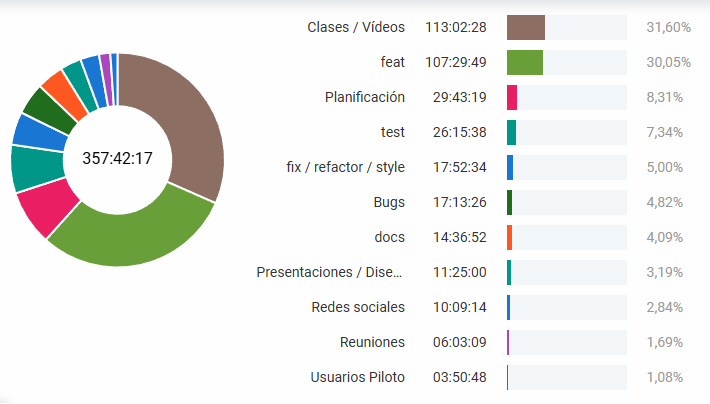
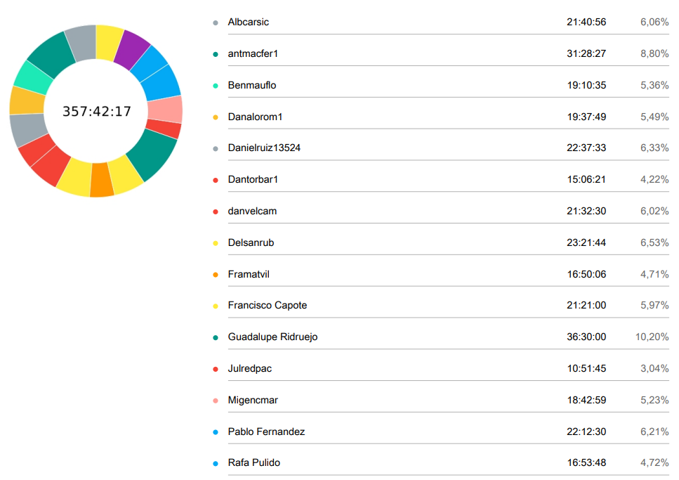

<!-- COMMENT THIS WHEN EXPORTING TO PDF -->

  

<h1 align="center" style="font-size: 30px; font-weight: bold;">
  FISIO FIND  -  INFORME DE TIEMPO #PPL (11/04 - 01/05)
</h1>

 

**ÍNDICE**
1. [PROYECTOS](#1-proyectos)  
    1.1 [DEFINICIÓN DE CADA PROYECTO](#11-definición-de-cada-proyecto)  
    1.2 [PROYECTOS REALIZADOS EN LA SEMANA](#12-proyectos-realizados-en-la-semana)  
    1.3 [PROYECTOS DESTACADOS](#13-proyectos-destacados)  
2. [HORAS TOTALES](#2-horas-totales)
3. [DESGLOSE](#3-desglose)  
    3.1 [DESGLOSE POR DÍAS](#31-desglose-por-días)  
    3.2 [DESGLOSE POR PROYECTOS](#32-desglose-por-proyectos)  
    3.3 [DESGLOSE POR INTEGRANTES](#33-desglose-por-integrantes)
<!-- COMMENT WHEN EXPORTING TO PDF -->

 

---

**Ficha del documento**

- **Nombre del Proyecto:** FISIO FIND

- **Número de Grupo:** Grupo 6

- **Entregable:** #PPL

- **Miembros del grupo:** Alberto Carmona Sicre, Antonio Macías Ferrera, Benjamín Ignacio Maureira Flores, Francisco Capote García, Daniel Alors Romero, Daniel Fernández Caballero, Daniel Ruiz López, Daniel Tortorici Bartús, Daniel Vela Camacho, Delfín Santana Rubio, Guadalupe Ridruejo Pineda, Julen Redondo Pacheco, Miguel Encina Martínez, Francisco Mateos Villarejo, Pablo Fernández Pérez, Ramón Gavira Sánchez, Rafael Pulido Cifuentes.

- **Contribuidores:** [Alberto Carmona Sicre](https://github.com/albcarsic) (autor), [Antonio Macías Ferrera](https://github.com/antoniommff) (revisor)

- **Fecha de Creación:** 01/05/2025  

- **Versión:** v1.0

 

---

<!-- \newpage -->

**Histórico de Modificaciones**

| Fecha      | Versión | Realizada por                    | Descripción de los cambios |
|------------|---------|----------------------------------|----------------------------|
| 10/04/2025 | v1.0    | Alberto Carmona Sicre            | Elaboración de la primera versión del documento de informe de tiempo del PPL |

 

<!-- \newpage -->

 

# 1. PROYECTOS

### IMPORTANTE: LAS HORAS ESTÁN CONTEMPLADAS HASTA LAS 09:00 DEL DÍA 01/05/2025, POR LO QUE ESTÁN INCOMPLETAS DE CARA A UNA ENTREGA MÁS RÁPIDA. ESTE DOCUMENTO SE ACTUALIZARÁ EN UN FUTURO.

## 1.1. Definición de cada proyecto

A continuación, se muestran los posibles tipos de tareas en las que pueden trabajar los integrantes del equipo, junto con una breve definición de estas:

- **Clases / Vídeos:** aquellas horas que corresponden a acudir a las clases presenciales de la asignatura, así como ver los vídeos que se ofrecen como contenido.

- **feat:** tanto este proyecto como los tres siguientes se referirán a tareas que requieran desarrollo de código en el repositorio. En concreto, este proyecto abarca aquellas tareas que se relacionen con el desarrollo de código y nuevas funcionalidades.

- **docs:** todo lo relacionado con la realización de los diferentes documentos que se redactarán a lo largo del proyecto.

- **fix / refactor / style:** en este apartado entra: corrección de código erróneo, refactorización del código y estilos de visualización de la aplicación.

- **test:** tipo de tarea para realizar las pruebas correspondientes tras la integración de nuevas funcionalidades que se crean terminadas.  

- **Planificación:** todo lo relacionado con la planificación del proyecto.  

- **Presentaciones / Diseños:** todo lo relacionado con preparar las presentaciones semanales de la asignatura o elaborar los diseños de la aplicación tales como logos, portadas, etc.  

- **Redes sociales:** para aquellas tareas relacionadas con la gestión de las redes sociales, posicionamiento y publicidad del proyecto.  

- **Reuniones:** como su nombre indica, son aquellas tareas en las que se invierte el tiempo en reuniones del equipo de carácter general.  

- **Usuarios Piloto:** tareas relacionadas con hacer de usuario piloto de los otros grupos de la asignatura.

- **Bugs:** tiempo dedicado a arreglar fallos en el sistema.

- **Security:** tareas relacionadas con el análisis y recopilación de temas de seguridad del sistema.

## 1.2. Proyectos realizados durante el sprint

Durante estas semanas de trabajo se ha trabajado en los siguientes proyectos:  

1. feat  

2. Clases/Vídeos  

3. docs  

4. Reuniones   

5. Presentaciones/Diseños  

6. Planificación

7. fix/refactor/style

8. Redes sociales 

9. Usuarios Piloto

10. test

11. Bugs

## 1.3. Proyectos destacados

Entre los proyectos más destacados, aquellos en los que se ha invertido más tiempo, encontramos los siguientes:  

- **Clases/Vídeos:** 113:02:28

- **feat:** 107:29:49

- **Planificación:** 29:43:19

Se han seguido aportando nuevas funcionalidades en la aplicación, y la planificación tanto del PPl como del WPL ha sido clave para afrontar los últimos pasos de la asignatura.

 

# 2. HORAS TOTALES
Para este sprint, el tiempo total dedicado al proyecto ha sido de 357 horas y 42 minutos.
  

 

# 3. DESGLOSE

Para una mejor visualización del tiempo dedicado, se realiza un desglose por días, proyectos e integrantes. 

## 3.1 Desglose por días  

Ordenado de manera cronológica:

- **Viernes 11/04:** 67:30:00  

- **Sábado 12/04:** 00:00:00

- **Domingo 13/04:** 04:00:00 

- **Lunes 14/04:** 06:00:00 

- **Martes 15/04:** 00:00:00 

- **Miércoles 16/04:** 00:00:00  

- **Jueves 17/04:** 00:00:00

- **Viernes 18/04:** 00:00:00

- **Sábado 19/04:** 02:00:00 

- **Domingo 20/04:** 09:45:41  

- **Lunes 21/04:** 22:42:54  

- **Martes 22/04:** 21:58:57

- **Miércoles 23/04:** 38:15:19

- **Jueves 24/04:** 20:29:47

- **Viernes 25/04:** 49:16:46  

- **Sábado 26/04:** 07:37:52  

- **Domingo 27/04:** 12:31:47  

- **Lunes 28/04:** 01:43:30  

- **Martes 29/04:** 43:13:32

- **Miércoles 30/04:** 41:11:38

- **Jueves 01/05:** 09:24:34 (Incompleto)

 

## 3.2 Desglose por proyectos  

Ordenado de mayor a menor tiempo dedicado en cada proyecto: 

**1. Clases/Vídeos:** 113:02:28

**2. feat:** 107:29:49

**3. Planificación:** 29:43:19

**4. test:** 26:15:38

**5. fix / refactor / style:**  17:52:34

**6. Bugs:** 17:13:26

**7. docs:** 14:36:52

**8. Presentaciones / Diseños:** 11:25:00

**9. Redes sociales:** 10:09:14

**10. Reuniones:** 06:03:09

**11. Usuarios Piloto:** 03:50:48

Diagrama de sectores para una mejor visualización de la división:

 

## 3.3 Desglose por integrantes

Ordenado por orden alfabético:

**1. Alberto Carmona Sicre** - 21:40:56

**2. Antonio Macías Ferrera** - 31:28:27

**3. Benjamín Ignacio Maureira Flores** -  19:10:35

**4. Daniel Alors Romero** - 19:37:49

**5. Daniel Fernández Caballero** - 19:02:53

**6. Daniel Ruiz López**  -  22:37:33

**7. Daniel Tortorici Bartús** - 15:06:21

**8. Daniel Vela Camacho** - 21:32:30

**9. Delfín Santana Rubio** - 23:21:44

**10. Francisco Capote García** - 21:21:00

**11. Francisco Mateos Villarejo** - 16:50:06

**12. Guadalupe Ridruejo Pineda** - 36:30:00

**13. Julen Redondo Pacheco** -  10:51:45

**14. Miguel Encina Martínez** -  18:42:59

**15. Pablo Fernández Pérez** -  22:12:30

**16. Ramón Gavira Sánchez**  -  20:41:21

**17. Rafael Pulido Cifuentes** -  16:53:48

Diagrama de sectores para una mejor visualización:

  
  

 

---

**Aprobado por:**  
**Scrum Master:** Antonio Macías Ferrera