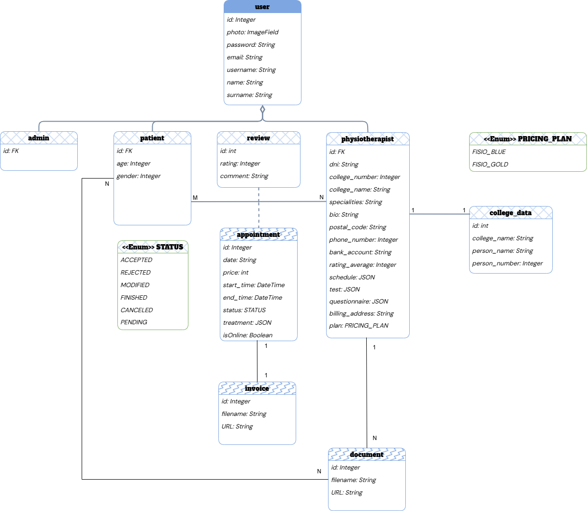

<!-- ---
title: "REUNIÓN PLANIFICACIÓN 26/04/2025"                            # CHANGE IF NEEDED
subtitle: "FISIO FIND - Grupo 6 - #PPL"
author: [Alberto Carmona Sicre, Antonio Macías Ferrera, Benjamín Ignacio Maureira Flores, Francisco Capote García, Daniel Alors Romero, Daniel Fernández Caballero, Daniel Ruiz López, Daniel Tortorici Bartús, Daniel Vela Camacho, Delfín Santana Rubio, Guadalupe Ridruejo Pineda, Julen Redondo Pacheco, Miguel Encina Martínez, Francisco Mateos Villarejo, Pablo Fernández Pérez, Ramón Gavira Sánchez, Rafael Pulido Cifuentes]
date: "26/04/2025"                                        # CHANGE IF NEEDED
subject: "ISPP"
lang: "es"
toc: true
titlepage: true
titlepage-text-color: "1C1C1C"
titlepage-rule-color: "1C1C1C"
titlepage-rule-height: 0
colorlinks: true
linkcolor: blue
titlepage-background: "../../.backgrounds/background3V.pdf"  # CHANGE IF NEEDED
header-left: "REUNIÓN"                                 # CHANGE IF NEEDED
header-right: "26/04/2025"                                # CHANGE IF NEEDED
footer-left: "FISIO FIND"
documentclass: scrartcl
classoption: "table"  
--- -->

<!-- COMMENT THIS WHEN EXPORTING TO PDF -->

  

<h1 align="center" style="font-size: 30px; font-weight: bold;">
  FISIO FIND  -  REUNIÓN PLANIFICACIÓN 26/04/2025
</h1>

 

**ÍNDICE**
- [**1. INTRODUCCIÓN**](#1-introducción)
- [**2. MATRIZ RACI**](#2-matriz-raci)
  - [**2.1 BACKEND**](#21-backend)
  - [**2.2 FRONTEND**](#22-frontend)
  - [**2.3 GENERAL**](#23-general)

<!-- COMMENT WHEN EXPORTING TO PDF -->

 

---

**Ficha del documento**

- **Nombre del Proyecto:** FISIO FIND

- **Número de Grupo:** Grupo 6

- **Entregable:** #PPL

- **Miembros del grupo:** Alberto Carmona Sicre, Antonio Macías Ferrera, Benjamín Ignacio Maureira Flores, Francisco Capote García, Daniel Alors Romero, Daniel Fernández Caballero, Daniel Ruiz López, Daniel Tortorici Bartús, Daniel Vela Camacho, Delfín Santana Rubio, Guadalupe Ridruejo Pineda, Julen Redondo Pacheco, Miguel Encina Martínez, Francisco Mateos Villarejo, Pablo Fernández Pérez, Ramón Gavira Sánchez, Rafael Pulido Cifuentes.

- **Contribuidores:** [Julen Redondo Pacheco](https://github.com/Julenrp) (autor)

- **Fecha de Creación:** 26/04/2025  

- **Versión:** v1.0

 

---

**Histórico de Modificaciones**

| Fecha      | Versión | Realizada por       | Descripción de los cambios                           |
| ---------- | ------- | ------------------- | ---------------------------------------------------- |
| 26/04/2025 | v1.0    | Julen Redondo Pacheco | Desarollo completo de todos los puntos del documento |

 

---

**Participantes**

| Nombre completo            | Rol           | Contacto              |
| -------------------------- | ------------- | --------------------- |
| Ramón Gavira Sánchez | --            | ramgavsan@alum.us.es  |
| Benjamín Ignacio Maureira Flores    | --            | benmauflo@alum.us.es |
| Antonio Macías Ferrera    | --            | antmacfer1@alum.us.es |
| Julen Redondo Pacheco | Secretario    | julredpac@alum.us.es  |
| Guadalupe Ridruejo Pineda     | -- | guaridpin@alum.us.es  |
| Delfín Santana Rubio        | --    | delsanrub@alum.us.es  |

 

<!-- \newpage -->

 

# **1. OBJETIVO DE LA REUNIÓN**
La finalidad de esta reunión del G2 es asignar las historias de usuario, definir los requisitos informacion y hacer el UML.

 

 

# **2. ORDEN DEL DÍA**
- ✅ **Tema 1:** Asignación de tareas generales.
- ✅ **Tema 2:** Asignación de historias de usuario.
- ✅ **Tema 3:** Definir requisitos de información.
- ✅ **Tema 4:** Hacer el UML.

 

 

# **3. ACUERDOS Y DECISIONES**

| Tema   | Decisión            |
| ------ | ------------------- |
| Tema 1 | Julen seguirá la tarea iterativa de búsqueda de competidores, buscando más competidores. |
| Tema 2 | Se asignaron las historias de usuario según la tabla de asignaciones que está más abajo. |
| Tema 3 | Se decidió redactar los requisitos de información después de que el resto del equipo vea el UML para así evitar modificaciones futuras en el registro de requisitos. |

| Historia de usuario | Asignado |
| ------------------- | -------- |
| HI-01 | Antonio Macías Ferrera |
| HI-02 | Ramón Gavira Sánchez |
| HP-02 | Julen Redondo Pacheco |
| HP-01 | Guadalupe Ridruejo Pineda | 
| HP-06 | Julen Redondo Pacheco |
| HF-01 | Benjamín Ignacio Maureira Flores |
| HF-02 | Benjamín Ignacio Maureira Flores |
| HA-01 | Delfín Santana Rubio |

 

 

# **4. CONCLUSIONES Y OBSERVACIONES**
- Se han asignado las tareas listadas en Acuerdos y Decisiones.
- Se decidió esperar a que el resto del equipo vea el UML antes de redactar los requisitos de información.
- Se hizo el UML. Aquí el resultado del UML.

{ width=450px, height=450px }

 

 

---

**Aprobado por:**
**Secretario:** Delfín Santana Rubio
