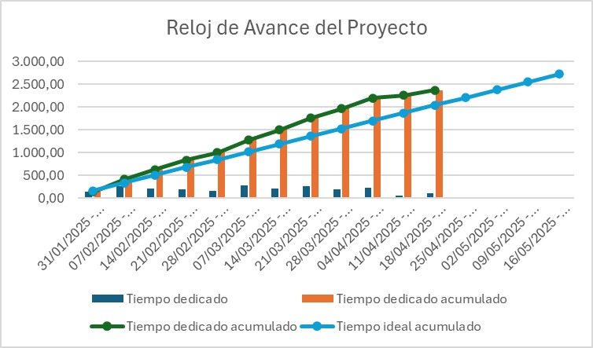

<!-- ---
title: "MID TERM RETROSPECTIVE - SPRINT 2 (14/03-27/03)"  # CHANGE IF NEEDED
subtitle: "FISIO FIND - Grupo 6 - #SPRINT 2"
author: [Alberto Carmona Sicre, Antonio Macías Ferrera, Benjamín Ignacio Maureira Flores, Francisco Capote García, Daniel Alors Romero, Daniel Fernández Caballero, Daniel Ruiz López, Daniel Tortorici Bartús, Daniel Vela Camacho, Delfín Santana Rubio, Guadalupe Ridruejo Pineda, Julen Redondo Pacheco, Miguel Encina Martínez, Francisco Mateos Villarejo, Pablo Fernández Pérez, Ramón Gavira Sánchez, Rafael Pulido Cifuentes]
date: "15/03/2025"                                        # CHANGE IF NEEDED
subject: "ISPP"
lang: "es"
toc: true
titlepage: true
titlepage-text-color: "1C1C1C"
titlepage-rule-color: "1C1C1C"
titlepage-rule-height: 0
colorlinks: true
linkcolor: blue
titlepage-background: "../../.backgrounds/background4V.pdf"  # CHANGE IF NEEDED
header-left: "MID TERM RETROSPECTIVE"                            # CHANGE IF NEEDED
header-right: "03/04/2025"                                # CHANGE IF NEEDED
footer-left: "FISIO FIND"
documentclass: scrartcl
classoption: "table"
--- -->

<!-- COMMENT THIS WHEN EXPORTING TO PDF -->

  

<h1 align="center" style="font-size: 30px; font-weight: bold;">
  FISIO FIND  -  MID TERM RETROSPECTIVE #PPL
</h1>

 

**ÍNDICE**
1. [PROYECTOS](#1-proyectos)  
    1.1 [DEFINICIÓN DE CADA PROYECTO](#11-definición-de-cada-proyecto)  

    1.2 [PROYECTOS REALIZADOS EN LA SEMANA](#12-proyectos-realizados-en-la-semana)

    1.3 [PROYECTOS DESTACADOS](#13-proyectos-destacados)
2. [HORAS TOTALES](#2-horas-totales)
3. [DESGLOSE](#3-desglose)  
    3.1 [DESGLOSE POR DÍAS](#31-desglose-por-días)  

    3.2 [DESGLOSE POR PROYECTOS](#32-desglose-por-proyectos) 

    3.3 [DESGLOSE POR INTEGRANTES](#33-desglose-por-integrantes)
<!-- COMMENT WHEN EXPORTING TO PDF -->

 

---

**Ficha del documento**

- **Nombre del Proyecto:** FISIO FIND

- **Número de Grupo:** Grupo 6

- **Entregable:** #PPL

- **Miembros del grupo:** Alberto Carmona Sicre, Antonio Macías Ferrera, Benjamín Ignacio Maureira Flores, Francisco Capote García, Daniel Alors Romero, Daniel Fernández Caballero, Daniel Ruiz López, Daniel Tortorici Bartús, Daniel Vela Camacho, Delfín Santana Rubio, Guadalupe Ridruejo Pineda, Julen Redondo Pacheco, Miguel Encina Martínez, Francisco Mateos Villarejo, Pablo Fernández Pérez, Ramón Gavira Sánchez, Rafael Pulido Cifuentes.

- **Contribuidores:** [Daniel Alors Romero](https://github.com/DanielAlors) (autor), [Francisco Mateos Villarejo](https://github.com/pacomateos10) (autor), [Miguel Encina Martínez](https://github.com/MiguelEncina) (revisor), [Benjamín Ignacio Maureira Flores](https://github.com/benjimrfl) 
- **Fecha de Creación:** 24/04/2025  

- **Versión:** v1.0

 

---

<!-- \newpage -->

**Histórico de Modificaciones**

| Fecha      | Versión | Realizada por                    | Descripción de los cambios |
|------------|---------|----------------------------------|----------------------------|
| 24/04/2025 | v1.0    | Daniel Alors Romero,  Francisco Mateos Villarejo, Miguel Encina Martínez, Benjamín Ignacio Maureira Flores  | Elaboración de la primera versión del documento |

 

<!-- \newpage -->

 

# 1. INFORMACIÓN DEL ESTUDIO QA

La siguiente tabla muestra la evaluación detallada de cada miembro del equipo según los siguientes criterios:

- **Dedicación:** Porcentaje de tiempo dedicado al proyecto
- **Compensación:** Equilibrio en la distribución de tareas
- **Disponibilidad:** Porcentaje de tiempo disponible para el proyecto
- **Compromiso:** Nivel de implicación con el proyecto
- **Prácticas:** Cumplimiento de las buenas prácticas de desarrollo
- **Valoración Final:** Evaluación global (E: Excelente, B: Bueno, R: Regular)

| Alumno | Dedicación | Compensación | Disponibilidad | Compromiso | Prácticas | Valoración Final | 
| ------ | ---------- | ------------ | -------------- | ---------- | --------- | ---------------- |
| Alberto Carmona Sicre | 30% | X | 10% | 28% | 30% | E |
| Antonio Macías Ferrera | 30% | X | 10% | 30% | 30% | E |
| Benjamín Ignacio Maureira Flores | 30% | X | 10% | 30% | 30% | E |
| Francisco Capote García | 30% | X | 10% | 30% | 30% | E |
| Daniel Alors Romero | 30% | X | 10% | 30% | 30% | E |
| Daniel Fernández Caballero | 30% | X | 10% | 30% | 30% | E |
| Daniel Ruíz López | 30% | X | 10% | 30% | 30% | E |
| Daniel Tortorici Bartús | 30% | X | 10% | 22% | 30% | E |
| Daniel Vela Camacho | 30% | X | 10% | 30% | 30% | E |
| Delfín Santana Rubio | 30% | X | 10% | 30% | 30% | E |
| Guadalupe Ridruejo Pineda | 30% | X | 10% | 30% | 30% | E |
| Julen Redondo Pacheco | 10% | X | 10% | 15% | 30% | R |
| Miguel Encina Martínez | 28% | X | 10% | 30% | 30% | E |
| Francisco Mateos Villarejo | 30% | X | 10% | 30% | 30% | E |
| Pablo Fernández Pérez | 30% | X | 10% | 30% | 30% | E |
| Ramón Gavira Sánchez | 30% | X | 10% | 30% | 30% | E |
| Rafael Pulido Cifuentes | 30% | X | 10% | 22% | 30% | E |

 

# 2. PROBLEMAS ENCONTRADOS

Durante la primera semana de este tercer Sprint, se han identificado varios desafíos significativos que han impactado en el avance del proyecto. A continuación, se detallan estos problemas, su resolución y su relación con los riesgos previamente identificados:

| Problema encontrado | Descripción detallada | Solución implementada | Riesgo relacionado | Estado | 
| ------------------- | -------------------- | -------------------- | ------------------ | ------ |
| Desacuerdo con la planificación del alcance del PPL | Algunos miembros no encontraron de su gusto la planificación acordada, debido a exceso de tareas de código y no relacionadas con el PPL. | Se comunicó entre miembros para llegar a un acuerdo y rebajar ciertas tareas de no relacionadas con el PPL. | Cerrado |

# 3. RELOJ DEL AVANCE DEL PROYECTO 

El gráfico muestra el progreso actual del proyecto en relación con la planificación inicial. Destacamos:

- **Horas estimadas:** 170 h
- **Horas realizadas:** 187 h 41 min
- **Causa principal:** Sobreesfuerzo de algunos miembros del equipo.
- **Impacto:** X
- **Medidas futuras:** X

---

**Aprobado por:**  
**Responsable de equipo de QA:** Miguel Encina Martínez
**Scrum Master:** Antonio Macías Ferrera  
**Fecha de aprobación:** 