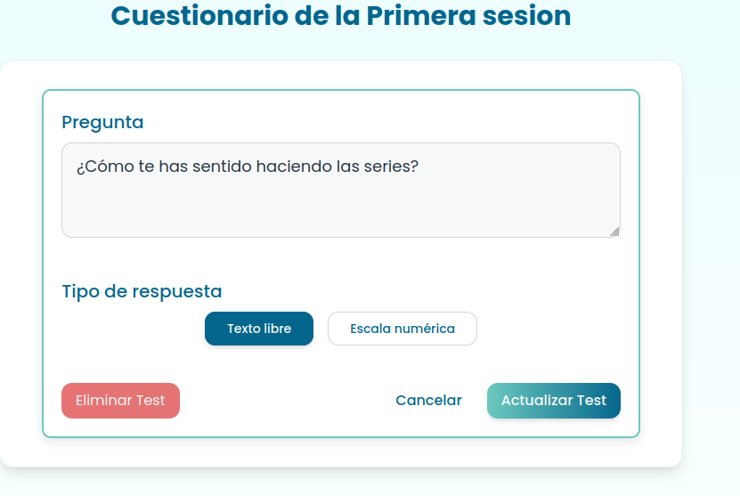

<!-- ---
title: "GUIA DE USO Y REVISIÓN"                           # CHANGE IF NEEDED
subtitle: "FISIO FIND - Grupo 6 - #WPL"
author: [Alberto Carmona Sicre, Antonio Macías Ferrera, Benjamín Ignacio Maureira Flores, Francisco Capote García, Daniel Alors Romero, Daniel Fernández Caballero, Daniel Ruiz López, Daniel Tortorici Bartús, Daniel Vela Camacho, Delfín Santana Rubio, Guadalupe Ridruejo Pineda, Julen Redondo Pacheco, Miguel Encina Martínez, Francisco Mateos Villarejo, Pablo Fernández Pérez, Ramón Gavira Sánchez, Rafael Pulido Cifuentes]
date: "21/05/2025"                                        # CHANGE IF NEEDED
subject: "ISPP"
lang: "es"
toc: true
titlepage: true
titlepage-text-color: "1C1C1C"
titlepage-rule-color: "1C1C1C"
titlepage-rule-height: 0
colorlinks: true
linkcolor: blue
titlepage-background: "../.backgrounds/background1V.pdf"  # CHANGE IF NEEDED
header-left: "GUIA DE USO Y REVISIÓN"                     # CHANGE IF NEEDED
header-right: "21/05/2025"                                # CHANGE IF NEEDED
footer-left: "FISIO FIND"
documentclass: scrartcl
classoption: "table"
--- -->


<!-- COMMENT THIS WHEN EXPORTING TO PDF -->
<p align="center">
  
</p>

<h1 align="center" style="font-size: 30px; font-weight: bold;">
  FISIO FIND  -  GUIA DE USO Y REVISIÓN
</h1>

<br>

**ÍNDICE**
- [1. INTRODUCCIÓN](#1-introducción)
- [2. ACCESO A LA APLICACIÓN](#2-acceso-a-la-aplicación)
- [3. DESCRIPCIÓN DE FUNCIONALIDADES NO TERMINADAS](#3-descripción-de-funcionalidades-no-terminadas)
- [4. DESCRIPCIÓN Y GUÍA DE LOS CASOS DE USO](#4-descripción-y-guía-de-los-casos-de-uso)
  - [**Búsqueda avanzada**](#búsqueda-avanzada)
  - [**Cuestionario de preintervención**](#cuestionario-de-preintervención)
  - [**Solicitud de una cita**](#solicitud-de-una-cita)
  - [**Gestión del calendario**](#gestión-del-calendario)
  - [**Videollamada y herramientas de la videollamada**](#videollamada-y-herramientas-de-la-videollamada)
  - [**Planes de precio**](#planes-de-precio)
  - [**Tratamientos**](#tratamientos)
  - [**Gestión de subida de archivos**](#gestión-de-subida-de-archivos)
  - [**Accesibilidad**](#accesibilidad)
- [5. DESPLIEGUE LOCAL](#5-despliegue-local)
  - [Prerrequisitos](#prerrequisitos)
  - [Instalación](#instalación)
  - [Configuración de la Base de Datos](#configuración-de-la-base-de-datos)
  - [Uso](#uso)
  - [Ejecución de la Aplicación](#ejecución-de-la-aplicación)
<!-- COMMENT THIS WHEN EXPORTING TO PDF -->


<br>

---

**Ficha del documento**

- **Nombre del Proyecto:** FISIO FIND
- **Número de Grupo:** Grupo 6

- **Entregable:** #WPL

- **Miembros del grupo:** Alberto Carmona Sicre, Antonio Macías Ferrera, Benjamín Ignacio Maureira Flores, Francisco Capote García, Daniel Alors Romero, Daniel Fernández Caballero, Daniel Ruiz López, Daniel Tortorici Bartús, Daniel Vela Camacho, Delfín Santana Rubio, Guadalupe Ridruejo Pineda, Julen Redondo Pacheco, Miguel Encina Martínez, Francisco Mateos Villarejo, Pablo Fernández Pérez, Ramón Gavira Sánchez, Rafael Pulido Cifuentes.

- **Autores:** [Delfín Santana Rubio](https://github.com/DelfinSR) (autor)

- **Fecha de Creación:** 21/05/2025  

- **Versión:** v1.0

<br>

<!-- \newpage -->

<br>


---

**Historial de modificaciones**

| Fecha          | Versión  | Realizada por            | Descripción de los cambios                |
| -------------- | -------- | ------------------------ | ----------------------------------------- |
| 21/05/2025     | v1.0     | Delfín Santana Rubio     | Versión inicial del documento             |

<br>

<!-- \newpage -->

<br>

# 1. INTRODUCCIÓN

FISIOFIND es una plataforma de consulta en línea diseñada para conectar fisioterapeutas y pacientes. La aplicación permite la gestión de citas, realización de consultas virtuales y procesamiento de pagos, facilitando la organización y el seguimiento de sesiones terapéuticas de forma segura y eficiente. La solución está orientada a dos grupos principales de usuarios: fisioterapeutas y pacientes.

En este documento se detalla una guía para el despliegue local de la aplicación, además de un desglose detallado para la realización de las pruebas del WPL.


<br>

<!-- \newpage -->

<br>


# 2. ACCESO A LA APLICACIÓN

Se podrá acceder a nuestra aplicación desplegada mediante el siguiente enlace: https://fisiofind.com/

Además, se podrá visitar nuestra landing page en la que nos publicitamos en: https://fisiofind-landing-page.netlify.app/

Toda nuestra documentación actualizada en: https://fisiofind.vercel.app/ 

Y, nuestro repositorio en GitHub: https://github.com/Proyecto-ISPP/FISIOFIND 

Una vez en nuestra aplicación, se podrá acceder sin necesidad de iniciar sesión a nuestra página principal y realizar una búsquedas iniciales de fisioterapeutas. De todas formas, para probar nuestras funcionalidades completas, facilitamos los siguientes credenciales:

El panel de administración se ha implementado en un subdominio por motivos de seguridad, siguiendo las mejores prácticas recomendadas: https://api.fisiofind.com/admin. No obstante, el administrador también puede iniciar sesión en el frontend para editar los documentos legales de forma más sencilla.

Credenciales: 

- Administrador:
  - Username: Administrador
  - Password: 65471364R65471364R

- Fisioterapeuta 1:
  - Username: Alberto
  - Password: 20029911Q20029911Q

- Fisioterapeuta 2:
  - Username: Lucía
  - Password: 41653473J41653473J
  
- Paciente 1: 
  - Username: Nerea
  - Password: 92956178E92956178E
  
- Paciente 2: 
  - Username: Claudia
  - Password: 36372053Z36372053Z


Vídeo demo: [https://github.com/Proyecto-ISPP/FISIOFIND/blob/main/docs/demo_5.webp](https://github.com/Proyecto-ISPP/FISIOFIND/blob/main/docs/demo_5.webm)

URL Clokify: [Tiempo WPL](https://app.clockify.me/shared/682e4249fa221513a5d50e4a)

La aplicación implementa validación de fisioterapeutas por número de colegiado. Si se quiere crear un nuevo fisioterapeuta se recomienda coger datos de estas urls que tienen datos de colegiados:
- Aragón: https://ventanilla.colfisioaragon.org/buscador-colegiados
- Cantabria: https://colfisiocant.org/busqueda-profesionales/
- Galicia: https://www.cofiga.org/ciudadanos/colegiados
- Madrid: https://cfisiomad.com/#/ext/buscarcolegiado
- Murcia: https://cfisiomurcia.com/buscador-de-colegiados/
- Andalucía: https://colfisio.org/registro-censo-fisioterapeutas
- Asturias: https://www.cofispa.org/censo-colegiados
- Islas Baleares: http://www.colfisiobalear.org/es/area-social-y-ciudadana/profesionales-colegiados/
- Islas Canarias: https://www.consejo-fisioterapia.org/vu_colegiados.html
- Castilla-La mancha: https://www.coficam.org/ventanilla-unica/censo-colegial
- Extremadura: https://cofext.org/cms/colegiados.php
- Castilla y León: https://www.consejo-fisioterapia.org/vu_colegiados.html
- Cataluña: https://www.fisioterapeutes.cat/es/ciudadanos/profesionales
- La Rioja: https://www.coflarioja.org/ciudadanos/listado-de-fisioterapeutas/buscar-colegiados
- Navarra: https://www.consejo-fisioterapia.org/vu_colegiados.html
- País Vasco: https://cofpv.org/es/colegiados.asp
- Comunidad Valenciana: https://app.colfisiocv.com/college/collegiatelist/

<br>

<!-- \newpage -->

<br>


# 3. DESCRIPCIÓN DE FUNCIONALIDADES NO TERMINADAS

La verificación de identidad de los fisioterapeutas funciona gracias a la integración de un servicio de la empresa PERSONA en la cual se deberá introducir una foto del DNI y escanear la cara de la persona que se quiere identificar. Este servicio actualmente está disponible, pero no verifica realmente la identidad de la persona que se quiere verificar para facilitar el inicio decisión como fisioterapeuta por parte de los docentes a la hora de realizar laa pruebas de la aplicación. Cabe mencionar que este servicio estará disponible hasta el 30 de mayo. Hemos intentado conseguir una licencia por más tiempo, pero nos requerían dar datos empresariales que, por razones obvias, a fecha de hoy no hemos podido proporcionar.


Por otro lado, tenemos implementado un chatbot, pero como tiene un número de llamadas limitadas, hemos preferido dejarlo en una pull request para evitar que se hable con él por error y se acaben las llamadas. El link a la pull request es: [https://github.com/Proyecto-ISPP/FISIOFIND/pull/567](https://github.com/Proyecto-ISPP/FISIOFIND/pull/567). El caso de uso del chatbot es el siguiente:
1. Un usuario entra en fisio find.
2. En una de las esquinas puede encontrar un icono en el que puede desplegar un chat para hablar con un chatbot para ayudarle a utilizar fisio find.


# 4. DESCRIPCIÓN Y GUÍA DE LOS CASOS DE USO 

En esta sección se explican los casos de uso entregados para el WPL y una guía detallada para probarlos. Muchos de estos casos ya se muestran en la demo.

Para comenzar, [en la pantalla principal del despliegue](https://fisiofind.com), encontrará una barra de navegación desplegable con distintos iconos y títulos descriptivos. Deberá navegar por estas pestañas para probar la aplicación.

Si se quiere hacer una cuenta, deberá de dar click en la sección superior de la home en la parte que pone registrarse. Igual para iniciar sesión. **Se recomienda poner un email real ya que hay funcionalidades que requieren validación por correo o que notifican a través del correo electrónico.**


Si se registra como fisio, mientras se registra le aparecerá una sección para seleccionar el plan de pago a utilizar.

Si inicia sesión como fisioterapeuta, en el navbar desplegable, verá un botón con título "Mi perfil". Si accede a esa vista verá el perfil de fisio, dónde podrá modificar su información, su horario y sus servicios. También, es en esta vista donde un fisio puede valorar la aplicación, dando al botón que aparece en la sección de "Tu valoración de la App" debajo del horario del fisio. Cuando el fisio crea una valoración, esta se verá en la home para todo aquel que visite la app. El fisio también puede editar y eliminar su valoración.

Si entra en la sección de videollamdas podrá crear una sala de prueba para probar la funcionalidad antes de utilizarlo. Es sólo cuando un fisioterapeuta tenga una cita que aparecerá la sala para contectarse un tiempo antes de la hora de la cita. Si entra en la videollamada podrá ver distintas herramientas: historial, compartir pantalla, modelos 3D, compartir con el usuario un mapa de dolor y cuestionarios.

Cuando una cita se termina, en la pantalla de tratamientos aparece la opción de crear un tratamiento.

Dentro del tratamiento el fisio puede gestionar sesiones de ejercicios para distintos días de la semana. Estas sesiones se componen de ejércitos creados específicamente para la sesión u otros ya creados por el fisio anteriormente, además de cuestionarios de control.

Cuando un paciente tiene una videollamada con un fisioterapeuta, al lado del botón de acceder aparece un botón para valorar. Si el usuario rellena la valoración, esto tiene un efecto que puede verse en el perfil de fisio.

Un paciente para buscar un fisioterapeuta puede acceder a la sección de buscar a través del botón de "Buscar" del desplegable.

## **Búsqueda avanzada**

1. Un usuario accede a la sección de buscar de fisios
2. Si rellena sus preferencias para la búsqueda y le da a buscar le aparecen fisios que cumplen esos valores.


## **Cuestionario de preintervención**

Caso de uso:
1. Un usuario (paciente o que o ha iniciado sesión) accede a la vista de reservar una cita con un fisioterapeuta.
2. Cuando selecciona el servicio y avanza en la vista, se le muestra un cuestionario de preintervención (porque se hace antes de la intervención) diseñado por el fisioterapeuta.
3. El usuario rellena el cuestionario, avanza en la vista y termina de reservar la cita.

Caso de uso:
1. Un fisioterapeuta accede a la vista de edición de su perfil.
2. Hay una sección para modificar sus servicios y sus cuestionarios de preintervención asociados.
3. El fisioterapeuta crea o edita un servicio o un cuestionario de preintervención.
4. Cuando el fisioterapeuta guarda, el sistema queda actualizado.


## **Solicitud de una cita**

Caso de uso:
1. Un usuario con rol paciente busca por especialidad en la página principal.
2. Se muestran los fisioterapeutas que tienen esa especialidad.
3. El paciente hace click en un fisioterapeuta.
4. Le lleva a una vista de reservar cita, en la que se muestra los servicios disponibles del fisioterapeuta y las fechas y horarios disponibles para la cita según avanza en la vista.
5. Cuando la vista lo muestre en el proceso, el paciente rellena el cuestionario de preintervención asociado al servicio seleccionado.
6. En el proceso, el usuario puede pagar y generar una factura.
7. El paciente finalmente la acepta.


## **Gestión del calendario**

Caso de uso:
1. Un fisioterapeuta entra en la sección de sus citas.
2. Puede visualizar las citas que han seleccionado los pacientes.
3. El fisioterapeuta puede aceptar la cita, cancelarla o proponer un cambio. No puede cambiar el horario de la cita sin enviar una propuesta de cambio y que el paciente lo acepte.
4. Si el paciente acepta el cambio, la cita queda confirmada.

## **Videollamada y herramientas de la videollamada**

Caso de uso:
1. Un fisioterapeuta abre la sección de videollamadas.
2. Si tiene citas programadas para ese día, desde 2 horas previas y hasta 2 horas después, podrá acceder a la sala correspondiente a esa cita (las citas deben reservarse al menos con 48 horas de antelación).


Caso de uso:
1. Un paciente abre la sección de videollamadas.
2. De forma análoga al fisioterapeuta, si tiene citas programadas para ese día, podrá acceder a la sala correspondiente a esa cita(cuando el sistema detecte que es la hora adecuada para que esté disponible). 

Caso de uso:
1. Un fisioterapeuta se conecta con un paciente a una videollamada.
2. El fisioterapeuta comparte su pantalla para compartir lo que necesite de su dispositivo.
3. El paciente lo visualiza correctamente.
4. El fisioterapeuta deja de compartir pantalla y vuelve a verse su cámara.

Caso de uso:
1. Un fisioterapeuta se conecta con un paciente a una videollamada.
2. El fisioterapeuta y el paciente tienen funcionalidades generales de videollamadas (silenciar audio, dejar de compartir cámara, etc.) y un chat para poder hablar.
3. Estas funcionalidades pueden activarse y desactivarse y no causan problemas con la videollamada.

Caso de uso:
1. Un fisioterapeuta se conecta con un paciente a una videollamada.
2. El fisioterapeuta tiene acceso a mapas de dolor (cuerpos humanos con los que se puede interactuar) que puede enviar al paciente como herramienta para ejercer su labor.
3. Cuando el paciente recibe el mapa de dolor, el fisioterapeuta y el paciente pueden interaccionar en tiempo real con el mapa de dolor.
4. Cuando el fisioterapeuta deja de necesitar el mapa de dolor, puede dejar de compartirlo.
5. Si el fisioterapeuta vuelve a enviar el mapa de dolor, el estado en el que se dejó se recupera. Esto solo funciona durante la videollamada (hasta que se cuelga o se recarga la página).


Caso de uso:
1. Un fisioterapeuta se conecta con un paciente a una videollamada.
2. El fisioterapeuta dispone de modelos 3D del cuerpo humano (sus músculos) y de ciertos músculos que resultan interesantes para un fisioterapeuta.
3. El fisioterapeuta puede resolver sus dudas anatómicas o tener referencia para ayudar al paciente.
4. El fisioterapeuta también puede compartir pantalla para poder enseñárselo al paciente.


Caso de uso:
1. Un fisioterapeuta se conecta con un paciente a una videollamada.
2. El fisioterapeuta dispone de formularios que puede pasar al paciente, pudiendo crearlos desde la misma videollamada.
3. Si el fisio decide enviarselo al paciente, al paciente le aparece.
4. Cuando el paciente lo rellena, el fisio puede ver el resultado.


## **Planes de precio**

Caso de uso:
1. Un fisioterapeuta no registrado quiere abrirse una cuenta en fisio find
2. Accede a la vista de registrarse como fisioterapeuta
3. Avanza rellenando campos hasta que se le da a elegir un plan de precio
4. Cuando lo selecciona se permite seguir con el registro y finalmente completarlo

## **Tratamientos**

Caso de uso:
1. Un fisioterapeuta entra en la sección de tratamientos.
2. En ella puede ver aquellos pacientes con los que tiene un tratamiento, que son aquellos con los que tiene una cita finalizada.
3. El fisioterapeuta entra en uno de los tratamientos y ve un resumen de la información del tratamiento (estos solo se mostrarán si hay registros hechos por el paciente).
4. Entra en la sección de nuevo ejercicio y puede crear un nuevo ejercicio desde cero o seleccionar uno existente.

Caso de uso:
1. Un fisioterapeuta entra en la sección de tratamientos
2. En ella puede ver aquellos pacientes con los que tiene un tratamiento
3. El fisioterapeuta entra en uno de los tratamientos y modifica algún dato
4. Cuanto termina, acepta el cambio y el sistema se actualiza




## **Gestión de subida de archivos**

Caso de uso:
1. El fisioterapeuta entra en la sección de subida de vídeos o de archivos (son dos secciones diferentes pero funcionan de manera similar) dentro del tratamiento.
2. Selecciona el archivo que quiere subir y rellena los datos necesarios.
3. Cuando completa el formulario, el paciente puede ver el archivo o vídeo.

Caso de uso:
1. El paciente entra en la sección de subida de archivos del tratamiento
2. Selecciona el archivo que quiere subir y rellena los datos necesarios.
3. Cuando completa el formulario, el fisioterapeuta puede ver el vídeo desde su respectiva sección.


## **Accesibilidad**

Caso de uso:
1. Un usuario con diversidad funcional entra en fisio find.
2. En una de las esquinas puede encontrar un icono en el que puede seleccionar opciones que le hagan la experiencia fisio find más sencilla.

<br>

<!-- \newpage -->

<br>


# 5. DESPLIEGUE LOCAL

Por último, en este epígrade se muestran las instrucciones para la puesta en funcionamiento del proyecto en un entorno local. También se pueden consular estas instrucciones en el archivo README del proyecto: https://github.com/Proyecto-ISPP/FISIOFIND/blob/main/README.md 


##  Prerrequisitos

Antes de comenzar con FISIOFIND, asegúrese de que su entorno de ejecución cumpla con los siguientes requisitos:

- **Lenguaje de Programación:** Python
- **Gestor de Paquetes:** Npm, Pip
- **Base de Datos:** Postgres


##  Instalación

Instale FISIOFIND utilizando uno de los siguientes métodos:

1. Clone el repositorio de FISIOFIND:
```sh
❯ git clone https://github.com/Proyecto-ISPP/FISIOFIND
```

1. Navegue al directorio del proyecto:
```sh
❯ cd FISIOFIND
```

1. Instale las dependencias del proyecto:

**Usando `pip`** &nbsp; [](https://pypi.org/project/pip/)

Primero, cree y active un entorno virtual de Python en el directorio `backend`:

```sh
❯ cd backend
❯ python -m venv venv
❯ source venv/bin/activate
```
Luego proceda a instalar las dependencias:

```sh
❯ pip install -r requirements.txt
```
**Usando `npm`** &nbsp; [](https://www.npmjs.com/)

Ahora instalamos las dependencias del framework frontend en el directorio `frontend`:

```sh
❯ cd ../frontend
❯ npm install
```

## Configuración de la Base de Datos

Para configurar la base de datos para FISIOFIND, siga estos pasos:

1. **Crear la Base de Datos:**

  Asegúrese de tener PostgreSQL instalado y en ejecución. Luego, cree una nueva base de datos llamada `fisiofind`:

  ```sh
  ❯ psql -U postgres
  postgres=# CREATE DATABASE fisiofind;
  postgres=# \q
  ```

2. **Configurar Variables de Entorno:**

  Copie el archivo `.env.example` para crear un nuevo archivo `.env` en el directorio `backend`:

  ```sh
  ❯ cd backend
  ❯ cp .env.example .env
  ```

  Abra el archivo `.env` y actualice la configuración de la base de datos con sus credenciales de PostgreSQL:

  ```env
  DATABASE_NAME=fisiofind
  DATABASE_USER=your_postgres_user
  DATABASE_PASSWORD=your_postgres_password
  DATABASE_HOST=localhost
  DATABASE_PORT=5432
  ```

  Reemplace `your_postgres_user` y `your_postgres_password` con su nombre de usuario y contraseña de PostgreSQL.

  Hay valores del .env que son secretos. Si quiere obtenerlos para la prueba contacte con info@fisiofind.com.

3. **Aplicar Migraciones:**

  Con el entorno virtual activado, aplique las migraciones de la base de datos para configurar el esquema inicial:

  ```sh
  ❯ python manage.py makemigrations
  ❯ python manage.py migrate
  ```

4. **Crear un Superusuario:**

  Cree una cuenta de superusuario para acceder al panel de administración de Django:

  ```sh
  ❯ python manage.py createsuperuser
  ```

  Siga las indicaciones para configurar las credenciales del superusuario.

Una vez completados estos pasos, su base de datos debería estar configurada y lista para usar con FISIOFIND.


##  Uso

La primera vez que el proyecto se despliega localmente, necesitamos crear un archivo .env en el directorio `backend` según el archivo `.env.example`.

Para ejecutar el servidor backend, siga estos pasos en el directorio `backend` **y con el entorno virtual activado**:

```sh
❯ cd .\fisio_find
❯ python .\manage.py makemigrations
❯ python .\manage.py migrate
❯ python .\manage.py runserver
```
Adicionalmente, la primera vez que el proyecto se despliega localmente, necesitamos crear un superusuario para acceder al panel de administración:

```sh
❯ python.\manage.py createsuperuser
```

Después de que el servidor backend local esté en funcionamiento, podemos ejecutar el servidor frontend **en una nueva ventana de terminal**:

**Usando `npm`** &nbsp; [](https://www.npmjs.com/)

```sh
❯ cd ../../frontend
❯ npm run dev
```

## Ejecución de la Aplicación

Una vez que tanto el backend como el frontend estén corriendo, podrá acceder a la aplicación a través de la URL de la landing page (`http://localhost:3000`). Desde allí se podrá navegar entre las diferentes secciones de la aplicación, según el perfil de usuario (fisioterapeuta, paciente o administrador).

---
